# BAB IV

**HASIL DAN PEMBAHASAN**

## 4.1 Definisi Masalah

### 4.1.1 Masalah

SMP PGRI Tambun Selatan merupakan sekolah menengah pertama yang berlokasi di Kabupaten Bekasi, Jawa Barat. Dengan jumlah siswa yang cukup banyak, proses penentuan siswa berprestasi menjadi tantangan tersendiri bagi pihak sekolah. Hingga saat ini, penentuan siswa berprestasi masih dilakukan secara manual dan cenderung subjektif berdasarkan penilaian guru. Ketiadaan sistem yang terstruktur dalam mengolah data nilai akademik siswa menyebabkan proses pengambilan keputusan tidak konsisten dan membutuhkan waktu yang lama.

Masalah ini diperparah oleh banyaknya kriteria yang harus dipertimbangkan seperti nilai mata pelajaran (PAI, Pendidikan Pancasila, Bahasa Indonesia, Matematika, IPA, IPS, Bahasa Inggris, Penjas, TIK, SBK, Prakarya, Bahasa Sunda, BTQ) serta faktor kehadiran siswa. Jika pengambilan keputusan tidak dilakukan secara tepat dan berbasis data, maka potensi untuk mengidentifikasi siswa berprestasi secara akurat tidak dapat diwujudkan secara optimal. Oleh karena itu, dibutuhkan pendekatan ilmiah yang mampu mendukung proses pengambilan keputusan secara objektif, terstruktur, dan akurat.

### 4.1.2 Penyelesaian Masalah

Upaya untuk menyelesaikan permasalahan dalam menentukan siswa berprestasi di SMP PGRI Tambun Selatan, penelitian ini menggunakan pendekatan sistem prediksi dengan metode Classification and Regression Tree (CART). Metode ini digunakan untuk menghasilkan model klasifikasi yang objektif dan sistematis dalam memprediksi status prestasi siswa berdasarkan data nilai akademik dan kehadiran.

Tahapan penyelesaian diawali dengan pengumpulan data siswa yang mencakup 14 fitur (nilai mata pelajaran dan jumlah absen) serta label status (berprestasi/tidak berprestasi). Data dikumpulkan dalam format CSV yang kemudian digunakan untuk melatih model CART. Sistem yang dibangun memiliki fitur manajemen model, prediksi tunggal, prediksi batch, serta manajemen pengguna dengan sistem autentikasi berbasis role.

Metode CART menghasilkan pohon keputusan yang dapat mengklasifikasikan siswa berdasarkan pola nilai akademik dan kehadiran. Model yang dihasilkan memiliki metrik evaluasi seperti akurasi, precision, recall, dan F1-score yang dapat digunakan untuk mengukur performa model.

Dengan pendekatan ini, proses pengambilan keputusan tidak hanya mempertimbangkan aspek subjektif, tetapi juga memperhatikan pola data historis siswa. Hasil akhir berupa prediksi status prestasi siswa memberikan dasar yang kuat bagi pihak sekolah dalam mengidentifikasi dan memberikan penghargaan kepada siswa berprestasi secara objektif dan konsisten.

## 4.2 Pembahasan Algoritma

### 4.2.1 Pengumpulan Data

Pengumpulan data pada penelitian metode CART untuk menentukan siswa berprestasi di SMP PGRI Tambun Selatan dilakukan dengan mengumpulkan data nilai akademik siswa. Data yang dikumpulkan meliputi 14 fitur sebagai berikut:

1. **Fitur Nilai Mata Pelajaran:**
   - PAI (Pendidikan Agama Islam)
   - Pendidikan Pancasila
   - Bahasa Indonesia
   - Matematika
   - IPA (Ilmu Pengetahuan Alam)
   - IPS (Ilmu Pengetahuan Sosial)
   - Bahasa Inggris
   - Penjas (Pendidikan Jasmani)
   - TIK (Teknologi Informasi dan Komunikasi)
   - SBK (Seni Budaya dan Keterampilan)
   - Prakarya
   - Bahasa Sunda
   - BTQ (Baca Tulis Quran)

2. **Fitur Kehadiran:**
   - Absen (Jumlah ketidakhadiran)

3. **Label Target:**
   - Status (berprestasi / tidak_berprestasi)

Data dikumpulkan dalam format CSV dan diolah menggunakan sistem yang telah dibangun dengan arsitektur backend menggunakan Python FastAPI dan frontend menggunakan React TypeScript.

### 4.2.2 Perhitungan Metode CART

Perhitungan yang digunakan dalam sistem prediksi siswa berprestasi menggunakan metode Classification and Regression Tree (CART). Langkah-langkah perhitungan akan dijelaskan sebagai berikut:

1. **Preprocessing Data:**
   - Konversi label status menjadi numerik (berprestasi = 1, tidak_berprestasi = 0)
   - Pengisian nilai yang hilang dengan median dari masing-masing fitur
   - Konversi semua fitur menjadi tipe numerik

2. **Pembagian Data:**
   - Data dibagi menjadi data training (80%) dan data testing (20%)
   - Pembagian dilakukan secara stratified untuk menjaga proporsi kelas

3. **Training Model CART:**
   - Menggunakan algoritma Decision Tree Classifier dengan kriteria Gini Impurity
   - Parameter yang digunakan:
     - criterion: "gini"
     - max_depth: 10
     - min_samples_split: 5
     - min_samples_leaf: 2

4. **Evaluasi Model:**
   - Accuracy: Persentase prediksi yang benar dari total data
   - Precision: Persentase prediksi positif yang benar
   - Recall: Persentase data positif yang berhasil diprediksi
   - F1-Score: Harmonic mean dari precision dan recall

5. **Prediksi:**
   - Model menghasilkan probabilitas untuk setiap kelas
   - Kelas dengan probabilitas tertinggi dipilih sebagai hasil prediksi

## 4.3 Pemodelan Perangkat Lunak

### 4.3.1 Pemodelan Perangkat Lunak dengan UML

Pemodelan perangkat lunak dengan UML (_Unified Modeling Language_) adalah bahasa pemodelan yang bersifat standar dan digunakan dalam rekayasa perangkat lunak untuk merepresentasikan, mendokumentasikan, dan merancang sistem perangkat lunak secara visual. Pemodelan perangkat lunak ini terdapat beberapa diagram yang digunakan sebagai penggambaran sistem secara keseluruhan yaitu _Use Case Diagram, Use Case Scenario, Class Diagram, Activity Diagram,_ dan _Sequence Diagram_.

#### 4.3.1.1 Use Case Diagram

_Use case diagram_ yang digunakan pada implementasi sistem prediksi siswa berprestasi ini menggambarkan interaksi antara aktor (pengguna) dengan sistem. Terdapat tiga role pengguna yaitu Super Admin, Admin, dan User dengan hak akses yang berbeda-beda. _Use case diagram_ dari Sistem Prediksi Siswa Berprestasi di SMP PGRI Tambun Selatan Menggunakan Metode CART ditunjukkan pada Gambar 4.1 sebagai berikut:

**Gambar 4.1 Use Case Diagram**

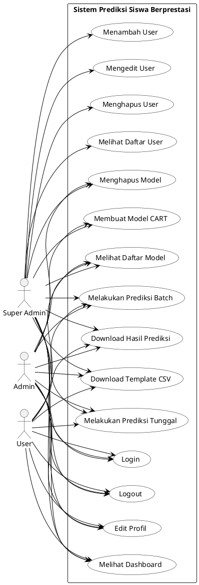
```plantuml
@startuml
left to right direction
skinparam packageStyle rectangle
skinparam usecase {
    BackgroundColor White
    BorderColor Black
    ArrowColor Black
}

actor "Super Admin" as SA
actor "Admin" as AD
actor "User" as US

rectangle "Sistem Prediksi Siswa Berprestasi" {
    ' Authentication
    usecase "Login" as UC1
    usecase "Logout" as UC2
    usecase "Edit Profil" as UC3
    
    ' Dashboard
    usecase "Melihat Dashboard" as UC4
    
    ' Model Management
    usecase "Melihat Daftar Model" as UC5
    usecase "Membuat Model CART" as UC6
    usecase "Menghapus Model" as UC7
    usecase "Download Template CSV" as UC8
    
    ' Prediction
    usecase "Melakukan Prediksi Tunggal" as UC9
    usecase "Melakukan Prediksi Batch" as UC10
    usecase "Download Hasil Prediksi" as UC11
    
    ' User Management
    usecase "Melihat Daftar User" as UC12
    usecase "Menambah User" as UC13
    usecase "Mengedit User" as UC14
    usecase "Menghapus User" as UC15
}

' User connections (basic access)
US --> UC1
US --> UC2
US --> UC3
US --> UC4
US --> UC5
US --> UC8
US --> UC9
US --> UC10
US --> UC11

' Admin extends User capabilities
AD --> UC1
AD --> UC2
AD --> UC3
AD --> UC4
AD --> UC5
AD --> UC6
AD --> UC7
AD --> UC8
AD --> UC9
AD --> UC10
AD --> UC11

' Super Admin has all access
SA --> UC1
SA --> UC2
SA --> UC3
SA --> UC4
SA --> UC5
SA --> UC6
SA --> UC7
SA --> UC8
SA --> UC9
SA --> UC10
SA --> UC11
SA --> UC12
SA --> UC13
SA --> UC14
SA --> UC15

@enduml
```

Sumber: Dokumen Pribadi

Berdasarkan Gambar 4.1, dapat dilihat bahwa sistem memiliki tiga aktor utama dengan hak akses berbeda:
- **User**: Dapat melakukan login, logout, edit profil, melihat dashboard, melihat daftar model, download template, dan melakukan prediksi
- **Admin**: Memiliki semua akses User ditambah kemampuan membuat dan menghapus model CART
- **Super Admin**: Memiliki semua akses Admin ditambah kemampuan mengelola user (melihat, menambah, mengedit, menghapus user)

#### 4.3.1.2 Use Case Scenario

Skenario _use case_ merupakan deskripsi rinci dan naratif dari langkah-langkah atau alur interaksi yang terjadi antara pengguna (aktor) dengan sistem dalam suatu _use case_ (kasus penggunaan). Skenario _use case_ menggambarkan urutan tindakan yang dilakukan untuk mencapai suatu tujuan tertentu, baik dalam kondisi normal (skenario utama) maupun kondisi alternatif (skenario alternatif) berikut ini:

##### a. Skenario Use Case Login

Sistem ini harus diawali dengan aktivitas _login_ dengan mengisi _form username_ dan _password_. Skenario _Use Case Login_ ditunjukkan pada Tabel 4.1 berikut ini:

**Tabel 4.1 Skenario Use Case Login**

| **Use Case** | Login |
|---|---|
| **Aktor** | User / Admin / Super Admin |
| **Kondisi Awal** | Pengguna belum terautentikasi dan berada di halaman login |
| **Kondisi Akhir** | Pengguna berhasil login dan masuk ke halaman dashboard |
| **Deskripsi** | Pengguna dapat mengakses sistem dengan memasukkan kredensial yang valid |

| **Pengguna** | **Sistem** |
|---|---|
| Membuka halaman login | Menampilkan form login dengan field username dan password |
| Mengisi username | |
| Mengisi password | |
| Klik tombol "Masuk" | |
| | Memvalidasi username dan password |
| | Jika valid: Membuat token JWT |
| | Menampilkan notifikasi "Login berhasil! Selamat datang kembali" |
| | Redirect ke halaman Dashboard |

**Skenario Alternatif (Login Gagal):**

| **Pengguna** | **Sistem** |
|---|---|
| Klik tombol "Masuk" dengan kredensial salah | |
| | Memvalidasi username dan password |
| | Jika tidak valid: Menampilkan notifikasi "Username atau password salah" |
| | Tetap di halaman login |

Sumber: Dokumen Pribadi

##### b. Skenario Use Case Logout

Setelah pengguna selesai menggunakan sistem, pengguna dapat melakukan logout untuk keluar dari sistem. Skenario _Use Case Logout_ ditunjukkan pada Tabel 4.2 berikut ini:

**Tabel 4.2 Skenario Use Case Logout**

| **Use Case** | Logout |
|---|---|
| **Aktor** | User / Admin / Super Admin |
| **Kondisi Awal** | Pengguna sudah login dan berada di halaman sistem |
| **Kondisi Akhir** | Pengguna berhasil logout dan kembali ke halaman login |
| **Deskripsi** | Pengguna dapat keluar dari sistem |

| **Pengguna** | **Sistem** |
|---|---|
| Klik tombol profil di header | Menampilkan dropdown menu |
| Klik menu "Keluar" | |
| | Menghapus token autentikasi |
| | Redirect ke halaman login |

Sumber: Dokumen Pribadi

##### c. Skenario Use Case Edit Profil

Pengguna dapat mengubah informasi profil seperti nama dan password. Skenario _Use Case Edit Profil_ ditunjukkan pada Tabel 4.3 berikut ini:

**Tabel 4.3 Skenario Use Case Edit Profil**

| **Use Case** | Edit Profil |
|---|---|
| **Aktor** | User / Admin / Super Admin |
| **Kondisi Awal** | Pengguna sudah login dan berada di halaman sistem |
| **Kondisi Akhir** | Data profil pengguna berhasil diperbarui |
| **Deskripsi** | Pengguna dapat mengubah nama dan password profil |

| **Pengguna** | **Sistem** |
|---|---|
| Klik tombol profil di header | Menampilkan dropdown menu |
| Klik menu "Edit Profil" | |
| | Menampilkan dialog edit profil |
| Mengisi nama baru (opsional) | |
| Mengisi password baru (opsional) | |
| Mengisi konfirmasi password | |
| Klik tombol "Simpan" | |
| | Memvalidasi data input |
| | Jika valid: Menyimpan perubahan ke database |
| | Menampilkan notifikasi "Profil berhasil diperbarui!" |
| | Menutup dialog |

Sumber: Dokumen Pribadi

##### d. Skenario Use Case Melihat Dashboard

Setelah login berhasil, pengguna akan diarahkan ke halaman dashboard yang menampilkan ringkasan sistem. Skenario _Use Case Melihat Dashboard_ ditunjukkan pada Tabel 4.4 berikut ini:

**Tabel 4.4 Skenario Use Case Melihat Dashboard**

| **Use Case** | Melihat Dashboard |
|---|---|
| **Aktor** | User / Admin / Super Admin |
| **Kondisi Awal** | Pengguna sudah login dan berada di sistem |
| **Kondisi Akhir** | Pengguna dapat melihat ringkasan statistik sistem |
| **Deskripsi** | Pengguna dapat melihat dashboard dengan informasi total model, total dataset, akurasi model terbaru, total prediksi, dan grafik distribusi status |

| **Pengguna** | **Sistem** |
|---|---|
| Klik menu "Dashboard" atau akses halaman utama | |
| | Mengambil data summary dari server |
| | Menampilkan kartu Total Model |
| | Menampilkan kartu Total Dataset |
| | Menampilkan kartu Akurasi Model Terbaru |
| | Menampilkan kartu Total Prediksi |
| | Menampilkan grafik pie chart Distribusi Status Prediksi |
| | Menampilkan grafik progress bar Akurasi Model |
| | Menampilkan informasi tentang sistem |

Sumber: Dokumen Pribadi

##### e. Skenario Use Case Membuat Model CART

Admin dan Super Admin dapat membuat model CART baru dengan mengupload dataset CSV. Skenario _Use Case Membuat Model CART_ ditunjukkan pada Tabel 4.5 berikut ini:

**Tabel 4.5 Skenario Use Case Membuat Model CART**

| **Use Case** | Membuat Model CART |
|---|---|
| **Aktor** | Admin / Super Admin |
| **Kondisi Awal** | Pengguna sudah login dengan role Admin atau Super Admin |
| **Kondisi Akhir** | Model CART baru berhasil dibuat dan tersimpan di database |
| **Deskripsi** | Pengguna dapat membuat model CART baru dengan mengupload file CSV dataset |

| **Pengguna** | **Sistem** |
|---|---|
| Klik menu "Model" | |
| | Menampilkan halaman Manajemen Model |
| Klik tombol "Buat Model" | |
| | Menampilkan dialog Buat Model Baru |
| Mengisi nama model (opsional) | |
| Memilih file CSV dataset | |
| Klik tombol "Latih Model" | |
| | Memvalidasi format file CSV |
| | Memvalidasi kolom yang diperlukan |
| | Melakukan preprocessing data |
| | Membagi data menjadi training dan testing |
| | Melatih model Decision Tree (CART) |
| | Menghitung metrik evaluasi (accuracy, precision, recall, f1-score) |
| | Menyimpan model ke file .joblib |
| | Menyimpan metadata model ke database |
| | Menampilkan notifikasi "Model berhasil dibuat! Model [nama] telah dilatih dengan akurasi [X]%" |
| | Menutup dialog |
| | Memperbarui daftar model |

**Skenario Alternatif (Gagal):**

| **Pengguna** | **Sistem** |
|---|---|
| Klik tombol "Latih Model" dengan file tidak valid | |
| | Memvalidasi format file |
| | Menampilkan notifikasi error "File harus berformat CSV" atau "Kolom tidak ditemukan: [nama_kolom]" |

Sumber: Dokumen Pribadi

##### f. Skenario Use Case Melihat Daftar Model

Pengguna dapat melihat daftar model CART yang telah dibuat. Skenario _Use Case Melihat Daftar Model_ ditunjukkan pada Tabel 4.6 berikut ini:

**Tabel 4.6 Skenario Use Case Melihat Daftar Model**

| **Use Case** | Melihat Daftar Model |
|---|---|
| **Aktor** | User / Admin / Super Admin |
| **Kondisi Awal** | Pengguna sudah login dan berada di sistem |
| **Kondisi Akhir** | Pengguna dapat melihat daftar model yang tersedia |
| **Deskripsi** | Pengguna dapat melihat daftar model CART beserta informasi akurasi dan metrik |

| **Pengguna** | **Sistem** |
|---|---|
| Klik menu "Model" | |
| | Mengambil daftar model dari server |
| | Menampilkan tabel daftar model dengan kolom: Nama Model, Akurasi, Precision, Recall, Dataset, Tanggal Dibuat, Aksi |

Sumber: Dokumen Pribadi

##### g. Skenario Use Case Menghapus Model

Admin dan Super Admin dapat menghapus model CART yang sudah tidak diperlukan. Skenario _Use Case Menghapus Model_ ditunjukkan pada Tabel 4.7 berikut ini:

**Tabel 4.7 Skenario Use Case Menghapus Model**

| **Use Case** | Menghapus Model |
|---|---|
| **Aktor** | Admin / Super Admin |
| **Kondisi Awal** | Model yang akan dihapus sudah ada di sistem |
| **Kondisi Akhir** | Model berhasil dihapus dari sistem |
| **Deskripsi** | Pengguna dapat menghapus model CART yang tidak diperlukan |

| **Pengguna** | **Sistem** |
|---|---|
| Klik ikon hapus pada baris model | |
| | Menampilkan dialog konfirmasi "Apakah Anda yakin ingin menghapus model [nama]?" |
| Klik "OK" untuk konfirmasi | |
| | Menghapus file model dari storage |
| | Menghapus metadata dari database |
| | Menampilkan notifikasi "Model berhasil dihapus dari sistem" |
| | Memperbarui daftar model |

Sumber: Dokumen Pribadi

##### h. Skenario Use Case Download Template CSV

Pengguna dapat mendownload template CSV untuk format data yang benar. Skenario _Use Case Download Template CSV_ ditunjukkan pada Tabel 4.8 berikut ini:

**Tabel 4.8 Skenario Use Case Download Template CSV**

| **Use Case** | Download Template CSV |
|---|---|
| **Aktor** | User / Admin / Super Admin |
| **Kondisi Awal** | Pengguna sudah login dan berada di halaman Model atau Prediksi |
| **Kondisi Akhir** | File template CSV berhasil didownload |
| **Deskripsi** | Pengguna dapat mendownload template CSV dengan format kolom yang benar |

| **Pengguna** | **Sistem** |
|---|---|
| Klik tombol "Download Template" | |
| | Membuat file CSV dengan header kolom yang diperlukan |
| | Mengirim file untuk didownload |
| | Browser mendownload file "template_siswa.csv" |

Sumber: Dokumen Pribadi

##### i. Skenario Use Case Melakukan Prediksi Tunggal

Pengguna dapat melakukan prediksi untuk satu siswa dengan mengisi form nilai. Skenario _Use Case Melakukan Prediksi Tunggal_ ditunjukkan pada Tabel 4.9 berikut ini:

**Tabel 4.9 Skenario Use Case Melakukan Prediksi Tunggal**

| **Use Case** | Melakukan Prediksi Tunggal |
|---|---|
| **Aktor** | User / Admin / Super Admin |
| **Kondisi Awal** | Terdapat minimal satu model yang sudah dibuat |
| **Kondisi Akhir** | Hasil prediksi ditampilkan kepada pengguna |
| **Deskripsi** | Pengguna dapat melakukan prediksi status prestasi untuk satu siswa |

| **Pengguna** | **Sistem** |
|---|---|
| Klik menu "Prediksi" | |
| | Menampilkan halaman Prediksi Siswa |
| Pilih model yang akan digunakan | |
| Klik tab "Satu Siswa" | |
| | Menampilkan form input nilai |
| Mengisi nama siswa (opsional) | |
| Mengisi nilai PAI | |
| Mengisi nilai Pendidikan Pancasila | |
| Mengisi nilai Bahasa Indonesia | |
| Mengisi nilai Matematika | |
| Mengisi nilai IPA | |
| Mengisi nilai IPS | |
| Mengisi nilai Bahasa Inggris | |
| Mengisi nilai Penjas | |
| Mengisi nilai TIK | |
| Mengisi nilai SBK | |
| Mengisi nilai Prakarya | |
| Mengisi nilai Bahasa Sunda | |
| Mengisi nilai BTQ | |
| Mengisi jumlah Absen | |
| Klik tombol "Prediksi" | |
| | Memvalidasi data input |
| | Mengirim data ke model CART |
| | Menghitung probabilitas setiap kelas |
| | Menyimpan hasil prediksi ke database |
| | Menampilkan hasil prediksi: Status (Berprestasi/Tidak Berprestasi), Probabilitas |
| | Menampilkan notifikasi "Prediksi berhasil" |

Sumber: Dokumen Pribadi

##### j. Skenario Use Case Melakukan Prediksi Batch

Pengguna dapat melakukan prediksi untuk banyak siswa sekaligus dengan mengupload file CSV. Skenario _Use Case Melakukan Prediksi Batch_ ditunjukkan pada Tabel 4.10 berikut ini:

**Tabel 4.10 Skenario Use Case Melakukan Prediksi Batch**

| **Use Case** | Melakukan Prediksi Batch |
|---|---|
| **Aktor** | User / Admin / Super Admin |
| **Kondisi Awal** | Terdapat minimal satu model yang sudah dibuat |
| **Kondisi Akhir** | Hasil prediksi batch ditampilkan kepada pengguna |
| **Deskripsi** | Pengguna dapat melakukan prediksi status prestasi untuk banyak siswa sekaligus |

| **Pengguna** | **Sistem** |
|---|---|
| Klik menu "Prediksi" | |
| | Menampilkan halaman Prediksi Siswa |
| Pilih model yang akan digunakan | |
| Klik tab "Banyak Siswa" | |
| | Menampilkan form upload file |
| Memilih file CSV berisi data siswa | |
| Klik tombol "Prediksi" | |
| | Memvalidasi format file CSV |
| | Memvalidasi kolom yang diperlukan (nama wajib, kode_unik opsional) |
| | Melakukan preprocessing data |
| | Mengirim data ke model CART |
| | Menghitung probabilitas untuk setiap siswa |
| | Menyimpan hasil prediksi ke database |
| | Menampilkan ringkasan: Total Data, Jumlah Berprestasi, Jumlah Tidak Berprestasi |
| | Menampilkan tabel hasil prediksi (10 data pertama) |
| | Menampilkan notifikasi "Prediksi batch berhasil. [X] data berhasil diprediksi" |

Sumber: Dokumen Pribadi

##### k. Skenario Use Case Download Hasil Prediksi

Pengguna dapat mendownload hasil prediksi batch dalam format CSV. Skenario _Use Case Download Hasil Prediksi_ ditunjukkan pada Tabel 4.11 berikut ini:

**Tabel 4.11 Skenario Use Case Download Hasil Prediksi**

| **Use Case** | Download Hasil Prediksi |
|---|---|
| **Aktor** | User / Admin / Super Admin |
| **Kondisi Awal** | Pengguna sudah melakukan prediksi batch |
| **Kondisi Akhir** | File hasil prediksi berhasil didownload |
| **Deskripsi** | Pengguna dapat mendownload hasil prediksi batch dalam format CSV |

| **Pengguna** | **Sistem** |
|---|---|
| Klik tombol "Download Hasil" pada hasil prediksi batch | |
| | Membuat file CSV dengan kolom: nama, kode_unik, nilai-nilai, prediksi, probabilitas_berprestasi, probabilitas_tidak_berprestasi |
| | Mengirim file untuk didownload |
| | Browser mendownload file "hasil_prediksi.csv" |
| | Menampilkan notifikasi "Download berhasil. File hasil prediksi telah diunduh" |

Sumber: Dokumen Pribadi

##### l. Skenario Use Case Melihat Daftar User

Super Admin dapat melihat daftar semua user yang terdaftar di sistem. Skenario _Use Case Melihat Daftar User_ ditunjukkan pada Tabel 4.12 berikut ini:

**Tabel 4.12 Skenario Use Case Melihat Daftar User**

| **Use Case** | Melihat Daftar User |
|---|---|
| **Aktor** | Super Admin |
| **Kondisi Awal** | Pengguna sudah login sebagai Super Admin |
| **Kondisi Akhir** | Daftar user ditampilkan kepada pengguna |
| **Deskripsi** | Super Admin dapat melihat daftar semua user yang terdaftar |

| **Pengguna** | **Sistem** |
|---|---|
| Klik menu "Users" | |
| | Mengambil daftar user dari server |
| | Menampilkan tabel daftar user dengan kolom: Username, Nama, Role, Tanggal Dibuat, Aksi |

Sumber: Dokumen Pribadi

##### m. Skenario Use Case Menambah User

Super Admin dapat menambahkan user baru ke sistem. Skenario _Use Case Menambah User_ ditunjukkan pada Tabel 4.13 berikut ini:

**Tabel 4.13 Skenario Use Case Menambah User**

| **Use Case** | Menambah User |
|---|---|
| **Aktor** | Super Admin |
| **Kondisi Awal** | Pengguna sudah login sebagai Super Admin |
| **Kondisi Akhir** | User baru berhasil ditambahkan ke sistem |
| **Deskripsi** | Super Admin dapat menambahkan user baru dengan role tertentu |

| **Pengguna** | **Sistem** |
|---|---|
| Klik menu "Users" | |
| | Menampilkan halaman Manajemen User |
| Klik tombol "Tambah User" | |
| | Menampilkan dialog Tambah User Baru |
| Mengisi username | |
| Mengisi nama lengkap | |
| Memilih role (User/Admin/Super Admin) | |
| Mengisi password | |
| Mengisi konfirmasi password | |
| Klik tombol "Simpan" | |
| | Memvalidasi data input |
| | Memeriksa username sudah digunakan atau belum |
| | Jika valid: Hash password dan simpan user ke database |
| | Menampilkan notifikasi "User berhasil dibuat! User [nama] telah ditambahkan" |
| | Menutup dialog |
| | Memperbarui daftar user |

**Skenario Alternatif (Username Sudah Ada):**

| **Pengguna** | **Sistem** |
|---|---|
| Klik tombol "Simpan" dengan username yang sudah ada | |
| | Memvalidasi username |
| | Menampilkan notifikasi error "Username sudah digunakan" |

Sumber: Dokumen Pribadi

##### n. Skenario Use Case Mengedit User

Super Admin dapat mengedit informasi user yang ada. Skenario _Use Case Mengedit User_ ditunjukkan pada Tabel 4.14 berikut ini:

**Tabel 4.14 Skenario Use Case Mengedit User**

| **Use Case** | Mengedit User |
|---|---|
| **Aktor** | Super Admin |
| **Kondisi Awal** | User yang akan diedit sudah ada di sistem |
| **Kondisi Akhir** | Data user berhasil diperbarui |
| **Deskripsi** | Super Admin dapat mengedit informasi user (username, nama, role, password) |

| **Pengguna** | **Sistem** |
|---|---|
| Klik ikon edit pada baris user | |
| | Menampilkan dialog Edit User dengan data user yang dipilih |
| Mengubah username (opsional) | |
| Mengubah nama lengkap (opsional) | |
| Mengubah role (opsional) | |
| Mengisi password baru (opsional) | |
| Mengisi konfirmasi password baru | |
| Klik tombol "Simpan" | |
| | Memvalidasi data input |
| | Menyimpan perubahan ke database |
| | Menampilkan notifikasi "User berhasil diperbarui! User [nama] telah diperbarui" |
| | Menutup dialog |
| | Memperbarui daftar user |

**Skenario Alternatif (Edit Akun Superadmin):**

| **Pengguna** | **Sistem** |
|---|---|
| Klik edit pada akun superadmin utama | |
| | Menampilkan dialog dengan hanya field password yang dapat diubah |
| | Menampilkan pesan "Untuk akun superadmin, hanya password yang dapat diubah" |

Sumber: Dokumen Pribadi

##### o. Skenario Use Case Menghapus User

Super Admin dapat menghapus user dari sistem. Skenario _Use Case Menghapus User_ ditunjukkan pada Tabel 4.15 berikut ini:

**Tabel 4.15 Skenario Use Case Menghapus User**

| **Use Case** | Menghapus User |
|---|---|
| **Aktor** | Super Admin |
| **Kondisi Awal** | User yang akan dihapus sudah ada di sistem |
| **Kondisi Akhir** | User berhasil dihapus dari sistem |
| **Deskripsi** | Super Admin dapat menghapus user dari sistem (kecuali akun superadmin utama dan akun sendiri) |

| **Pengguna** | **Sistem** |
|---|---|
| Klik ikon hapus pada baris user | |
| | Menampilkan dialog konfirmasi "Apakah Anda yakin ingin menghapus user [nama]?" |
| Klik "OK" untuk konfirmasi | |
| | Menghapus user dari database |
| | Menampilkan notifikasi "User berhasil dihapus! User telah dihapus dari sistem" |
| | Memperbarui daftar user |

**Skenario Alternatif (Tidak Dapat Menghapus):**

| **Pengguna** | **Sistem** |
|---|---|
| Mencoba menghapus akun superadmin utama | |
| | Menampilkan error "Akun superadmin utama tidak dapat dihapus" |

Sumber: Dokumen Pribadi

#### 4.3.1.3 Class Diagram

_Class diagram_ digunakan untuk menggambarkan rancangan berupa entitas yang digunakan dalam sistem beserta relasi antar entitas. Sistem ini menggunakan arsitektur backend dengan Python FastAPI dan frontend dengan React TypeScript. Berikut _class diagram_ dari Sistem Prediksi Siswa Berprestasi di SMP PGRI Tambun Selatan Menggunakan Metode CART ditunjukkan pada Gambar 4.2 berikut ini:

**Gambar 4.2 Class Diagram**

```plantuml
@startuml
skinparam classAttributeIconSize 0
skinparam class {
    BackgroundColor White
    BorderColor Black
    ArrowColor Black
}

' Enums
enum UserRole {
    SUPER_ADMIN
    ADMIN
    USER
}

' Database Models (Backend)
class UserDB {
    - id: String
    - username: String
    - name: String
    - password: String
    - role: UserRole
    - created_at: DateTime
    - updated_at: DateTime
}

class ModelDB {
    - id: Integer
    - name: String
    - file_path: String
    - accuracy: Float
    - metrics: Text
    - dataset_path: String
    - created_at: DateTime
}

class DatasetDB {
    - id: Integer
    - name: String
    - file_path: String
    - row_count: Integer
    - uploaded_at: DateTime
}

class PredictionDB {
    - id: Integer
    - model_id: Integer
    - input_data: Text
    - prediction: String
    - probability: Text
    - created_at: DateTime
}

' API Models (Pydantic)
class StudentFeatures {
    + pai: Float
    + pendidikan_pancasila: Float
    + bahasa_indonesia: Float
    + matematika: Float
    + ipa: Float
    + ips: Float
    + bahasa_inggris: Float
    + penjas: Float
    + tik: Float
    + sbk: Float
    + prakarya: Float
    + bahasa_sunda: Float
    + btq: Float
    + absen: Float
}

class PredictRequest {
    + model_id: Integer
    + nama: String
    + features: StudentFeatures
}

class PredictResponse {
    + prediction: String
    + probability: Dict
    + nama: String
}

class BatchPredictResponse {
    + results: List<BatchPredictResult>
    + total_count: Integer
    + berprestasi_count: Integer
    + tidak_berprestasi_count: Integer
}

class DashboardSummary {
    + total_models: Integer
    + total_datasets: Integer
    + latest_model_accuracy: Float
    + status_distribution: Dict
    + prediction_stats: Dict
}

' Services
class AuthService {
    + verify_password(plain, hashed): Boolean
    + get_password_hash(password): String
    + create_access_token(data, expires): String
    + decode_token(token): Dict
    + get_user_by_username(db, username): UserDB
    + get_user_by_id(db, user_id): UserDB
    + create_user(db, username, name, password, role): UserDB
    + authenticate_user(db, username, password): UserDB
    + get_all_users(db): List<UserDB>
    + update_user(db, user_id, ...): UserDB
    + delete_user(db, user_id): Boolean
    + get_current_user(credentials, db): UserDB
}

class MLService {
    - models_dir: String
    - _loaded_models: Dict
    + validate_csv_columns(df, require_status): Tuple
    + preprocess_data(df): DataFrame
    + train_model(df, model_name, target_column): Dict
    + load_model(model_id, file_path): Any
    + predict(model_id, file_path, features): Dict
    + predict_batch(model_id, file_path, df): List<Dict>
    + get_feature_importance(model_id, file_path): Dict
}

class DBService {
    + init_db(): void
    + get_db(): Session
    + create_model(db, ...): ModelDB
    + get_model(db, model_id): ModelDB
    + get_all_models(db): List<ModelDB>
    + delete_model(db, model_id): Boolean
    + get_latest_model(db): ModelDB
    + create_dataset(db, ...): DatasetDB
    + get_dataset(db, dataset_id): DatasetDB
    + get_all_datasets(db): List<DatasetDB>
    + delete_dataset(db, dataset_id): Boolean
    + create_prediction(db, ...): PredictionDB
    + get_prediction_stats(db): Dict
    + get_status_distribution(db): Dict
}

' API Routes
class AuthRoutes {
    + login(request): TokenResponse
    + register(request): UserResponse
    + get_me(): UserResponse
    + list_users(): List<UserResponse>
    + verify_token(): UserResponse
    + update_my_profile(request): UserResponse
    + update_user_by_admin(user_id, request): UserResponse
    + delete_user_by_admin(user_id): MessageResponse
}

class ModelRoutes {
    + train_model(file, name, target_column): ModelTrainResponse
    + list_models(): List<ModelMeta>
    + get_model_detail(model_id): ModelMeta
    + delete_model_endpoint(model_id): MessageResponse
    + download_csv_template(): StreamingResponse
    + get_dashboard_summary(): DashboardSummary
}

class PredictRoutes {
    + predict_single(request): PredictResponse
    + predict_batch(file, model_id): BatchPredictResponse
    + predict_batch_download(file, model_id): StreamingResponse
}

class DatasetRoutes {
    + upload_dataset(file, name): DatasetMeta
    + list_datasets(): List<DatasetMeta>
    + get_dataset_detail(dataset_id): DatasetMeta
    + delete_dataset_endpoint(dataset_id): MessageResponse
    + preview_dataset(dataset_id, limit): Dict
}

' Relationships
UserDB --> UserRole
PredictionDB --> ModelDB : model_id

AuthService --> UserDB : manages
MLService --> ModelDB : uses
DBService --> ModelDB : manages
DBService --> DatasetDB : manages
DBService --> PredictionDB : manages

AuthRoutes --> AuthService : uses
ModelRoutes --> MLService : uses
ModelRoutes --> DBService : uses
PredictRoutes --> MLService : uses
PredictRoutes --> DBService : uses
DatasetRoutes --> DBService : uses

PredictRequest --> StudentFeatures : contains
BatchPredictResponse --> PredictResponse : contains

@enduml
```

Sumber: Dokumen Pribadi

Berdasarkan Gambar 4.2, sistem terdiri dari beberapa komponen utama:
- **Database Models**: UserDB, ModelDB, DatasetDB, PredictionDB untuk menyimpan data ke MySQL
- **API Models**: StudentFeatures, PredictRequest, PredictResponse untuk validasi request/response
- **Services**: AuthService (autentikasi), MLService (machine learning), DBService (database operations)
- **Routes**: AuthRoutes, ModelRoutes, PredictRoutes, DatasetRoutes untuk menangani HTTP requests

#### 4.3.1.4 Activity Diagram

_Activity diagram_ digunakan untuk menggambarkan alur proses dari Sistem Prediksi Siswa Berprestasi di SMP PGRI Tambun Selatan Menggunakan Metode CART. Berikut _activity diagram_ pada penelitian ini:

##### a. Activity Diagram Login

_Activity diagram_ ini merupakan langkah awal untuk pengguna dapat mengelola sistem aplikasi untuk masuk ke dalam halaman dashboard. _Activity Diagram Login_ ditunjukan pada Gambar 4.3

**Gambar 4.3 Activity Diagram Login**

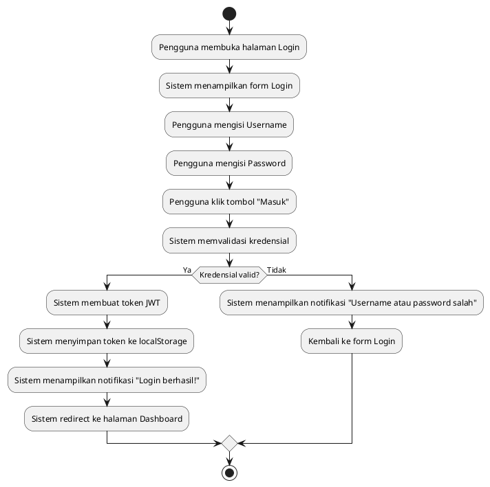
```plantuml
@startuml
start
:Pengguna membuka halaman Login;
:Sistem menampilkan form Login;

:Pengguna mengisi Username;
:Pengguna mengisi Password;
:Pengguna klik tombol "Masuk";

:Sistem memvalidasi kredensial;

if (Kredensial valid?) then (Ya)
    :Sistem membuat token JWT;
    :Sistem menyimpan token ke localStorage;
    :Sistem menampilkan notifikasi "Login berhasil!";
    :Sistem redirect ke halaman Dashboard;
else (Tidak)
    :Sistem menampilkan notifikasi "Username atau password salah";
    :Kembali ke form Login;
endif

stop
@enduml
```

Sumber: Dokumen Pribadi

##### b. Activity Diagram Logout

_Activity diagram_ ini menggambarkan proses pengguna untuk keluar dari sistem. _Activity Diagram Logout_ ditunjukkan pada Gambar 4.4

**Gambar 4.4 Activity Diagram Logout**

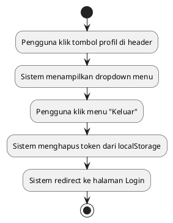
```plantuml
@startuml
start
:Pengguna klik tombol profil di header;
:Sistem menampilkan dropdown menu;
:Pengguna klik menu "Keluar";
:Sistem menghapus token dari localStorage;
:Sistem redirect ke halaman Login;
stop
@enduml
```

Sumber: Dokumen Pribadi

##### c. Activity Diagram Membuat Model CART

_Activity diagram_ ini menggambarkan proses pembuatan model CART baru dengan mengupload dataset CSV. _Activity Diagram Membuat Model CART_ ditunjukkan pada Gambar 4.5

**Gambar 4.5 Activity Diagram Membuat Model CART**

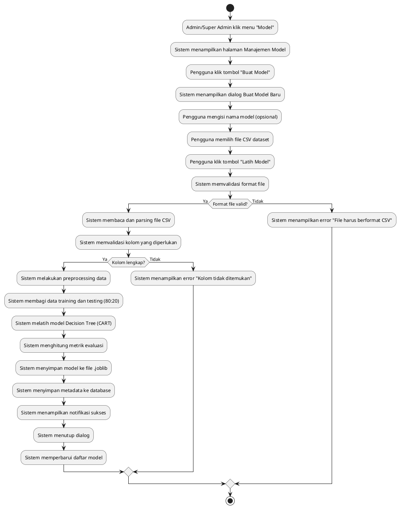
```plantuml
@startuml
start
:Admin/Super Admin klik menu "Model";
:Sistem menampilkan halaman Manajemen Model;
:Pengguna klik tombol "Buat Model";
:Sistem menampilkan dialog Buat Model Baru;

:Pengguna mengisi nama model (opsional);
:Pengguna memilih file CSV dataset;
:Pengguna klik tombol "Latih Model";

:Sistem memvalidasi format file;

if (Format file valid?) then (Ya)
    :Sistem membaca dan parsing file CSV;
    :Sistem memvalidasi kolom yang diperlukan;
    
    if (Kolom lengkap?) then (Ya)
        :Sistem melakukan preprocessing data;
        :Sistem membagi data training dan testing (80:20);
        :Sistem melatih model Decision Tree (CART);
        :Sistem menghitung metrik evaluasi;
        :Sistem menyimpan model ke file .joblib;
        :Sistem menyimpan metadata ke database;
        :Sistem menampilkan notifikasi sukses;
        :Sistem menutup dialog;
        :Sistem memperbarui daftar model;
    else (Tidak)
        :Sistem menampilkan error "Kolom tidak ditemukan";
    endif
else (Tidak)
    :Sistem menampilkan error "File harus berformat CSV";
endif

stop
@enduml
```

Sumber: Dokumen Pribadi

##### d. Activity Diagram Menghapus Model

_Activity diagram_ ini menggambarkan proses penghapusan model CART dari sistem. _Activity Diagram Menghapus Model_ ditunjukkan pada Gambar 4.6

**Gambar 4.6 Activity Diagram Menghapus Model**

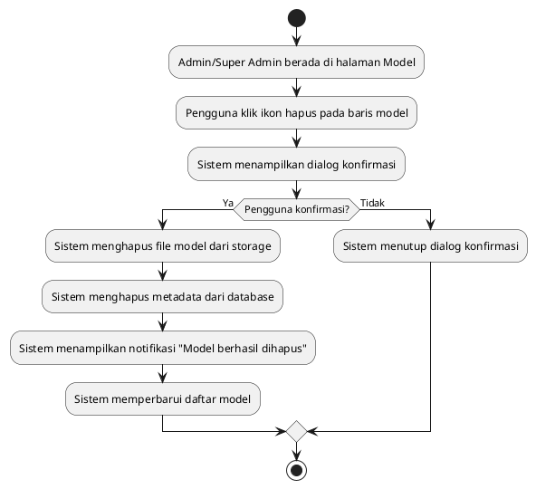
```plantuml
@startuml
start
:Admin/Super Admin berada di halaman Model;
:Pengguna klik ikon hapus pada baris model;
:Sistem menampilkan dialog konfirmasi;

if (Pengguna konfirmasi?) then (Ya)
    :Sistem menghapus file model dari storage;
    :Sistem menghapus metadata dari database;
    :Sistem menampilkan notifikasi "Model berhasil dihapus";
    :Sistem memperbarui daftar model;
else (Tidak)
    :Sistem menutup dialog konfirmasi;
endif

stop
@enduml
```

Sumber: Dokumen Pribadi

##### e. Activity Diagram Melakukan Prediksi Tunggal

_Activity diagram_ ini menggambarkan proses prediksi untuk satu siswa dengan mengisi form nilai. _Activity Diagram Melakukan Prediksi Tunggal_ ditunjukkan pada Gambar 4.7

**Gambar 4.7 Activity Diagram Melakukan Prediksi Tunggal**

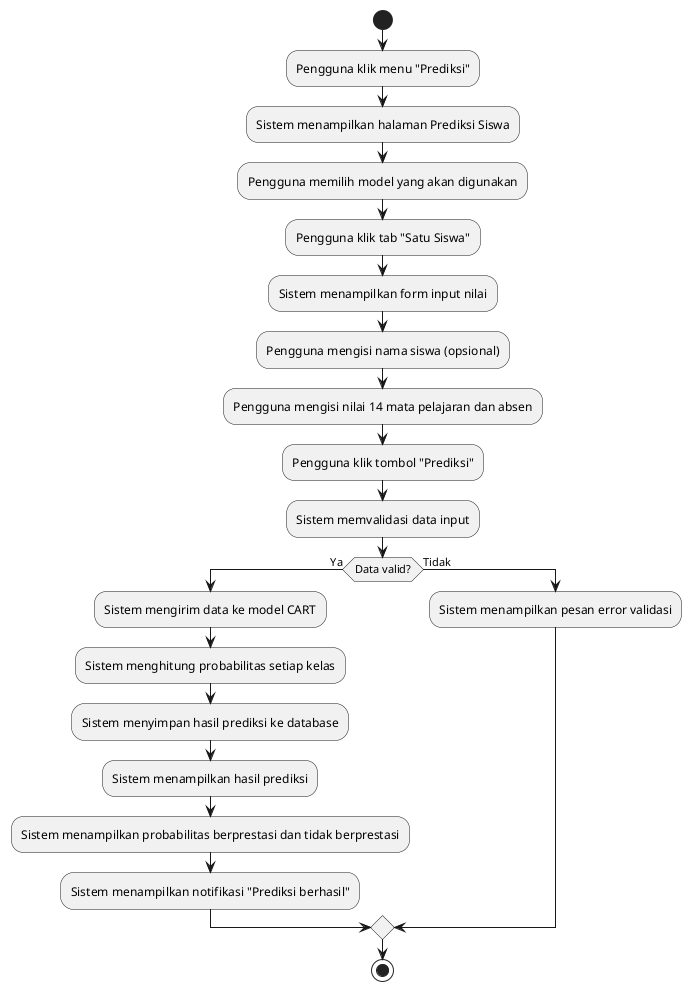
```plantuml
@startuml
start
:Pengguna klik menu "Prediksi";
:Sistem menampilkan halaman Prediksi Siswa;

:Pengguna memilih model yang akan digunakan;
:Pengguna klik tab "Satu Siswa";
:Sistem menampilkan form input nilai;

:Pengguna mengisi nama siswa (opsional);
:Pengguna mengisi nilai 14 mata pelajaran dan absen;
:Pengguna klik tombol "Prediksi";

:Sistem memvalidasi data input;

if (Data valid?) then (Ya)
    :Sistem mengirim data ke model CART;
    :Sistem menghitung probabilitas setiap kelas;
    :Sistem menyimpan hasil prediksi ke database;
    :Sistem menampilkan hasil prediksi;
    :Sistem menampilkan probabilitas berprestasi dan tidak berprestasi;
    :Sistem menampilkan notifikasi "Prediksi berhasil";
else (Tidak)
    :Sistem menampilkan pesan error validasi;
endif

stop
@enduml
```

Sumber: Dokumen Pribadi

##### f. Activity Diagram Melakukan Prediksi Batch

_Activity diagram_ ini menggambarkan proses prediksi untuk banyak siswa dengan mengupload file CSV. _Activity Diagram Melakukan Prediksi Batch_ ditunjukkan pada Gambar 4.8

**Gambar 4.8 Activity Diagram Melakukan Prediksi Batch**

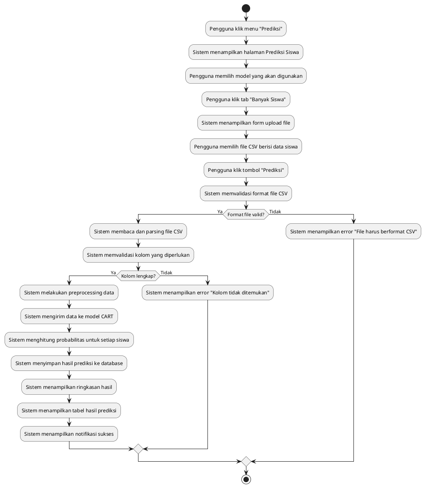
```plantuml
@startuml
start
:Pengguna klik menu "Prediksi";
:Sistem menampilkan halaman Prediksi Siswa;

:Pengguna memilih model yang akan digunakan;
:Pengguna klik tab "Banyak Siswa";
:Sistem menampilkan form upload file;

:Pengguna memilih file CSV berisi data siswa;
:Pengguna klik tombol "Prediksi";

:Sistem memvalidasi format file CSV;

if (Format file valid?) then (Ya)
    :Sistem membaca dan parsing file CSV;
    :Sistem memvalidasi kolom yang diperlukan;
    
    if (Kolom lengkap?) then (Ya)
        :Sistem melakukan preprocessing data;
        :Sistem mengirim data ke model CART;
        :Sistem menghitung probabilitas untuk setiap siswa;
        :Sistem menyimpan hasil prediksi ke database;
        :Sistem menampilkan ringkasan hasil;
        :Sistem menampilkan tabel hasil prediksi;
        :Sistem menampilkan notifikasi sukses;
    else (Tidak)
        :Sistem menampilkan error "Kolom tidak ditemukan";
    endif
else (Tidak)
    :Sistem menampilkan error "File harus berformat CSV";
endif

stop
@enduml
```

Sumber: Dokumen Pribadi

##### g. Activity Diagram Manajemen User

_Activity diagram_ ini menggambarkan proses pengelolaan user oleh Super Admin. _Activity Diagram Manajemen User_ ditunjukkan pada Gambar 4.9

**Gambar 4.9 Activity Diagram Manajemen User**

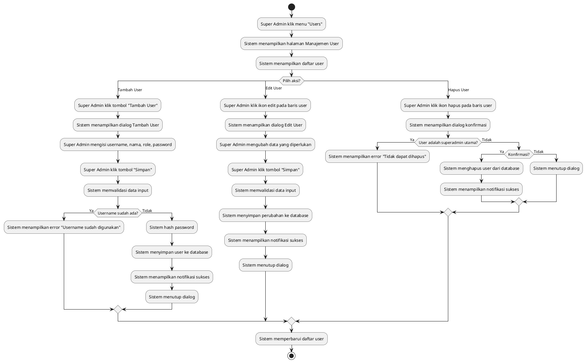
```plantuml
@startuml
start
:Super Admin klik menu "Users";
:Sistem menampilkan halaman Manajemen User;
:Sistem menampilkan daftar user;

switch (Pilih aksi?)
case (Tambah User)
    :Super Admin klik tombol "Tambah User";
    :Sistem menampilkan dialog Tambah User;
    :Super Admin mengisi username, nama, role, password;
    :Super Admin klik tombol "Simpan";
    :Sistem memvalidasi data input;
    
    if (Username sudah ada?) then (Ya)
        :Sistem menampilkan error "Username sudah digunakan";
    else (Tidak)
        :Sistem hash password;
        :Sistem menyimpan user ke database;
        :Sistem menampilkan notifikasi sukses;
        :Sistem menutup dialog;
    endif
    
case (Edit User)
    :Super Admin klik ikon edit pada baris user;
    :Sistem menampilkan dialog Edit User;
    :Super Admin mengubah data yang diperlukan;
    :Super Admin klik tombol "Simpan";
    :Sistem memvalidasi data input;
    :Sistem menyimpan perubahan ke database;
    :Sistem menampilkan notifikasi sukses;
    :Sistem menutup dialog;
    
case (Hapus User)
    :Super Admin klik ikon hapus pada baris user;
    :Sistem menampilkan dialog konfirmasi;
    
    if (User adalah superadmin utama?) then (Ya)
        :Sistem menampilkan error "Tidak dapat dihapus";
    else (Tidak)
        if (Konfirmasi?) then (Ya)
            :Sistem menghapus user dari database;
            :Sistem menampilkan notifikasi sukses;
        else (Tidak)
            :Sistem menutup dialog;
        endif
    endif
endswitch

:Sistem memperbarui daftar user;
stop
@enduml
```

Sumber: Dokumen Pribadi

##### h. Activity Diagram Melihat Dashboard

_Activity diagram_ ini menggambarkan proses melihat dashboard sistem. _Activity Diagram Melihat Dashboard_ ditunjukkan pada Gambar 4.10

**Gambar 4.10 Activity Diagram Melihat Dashboard**

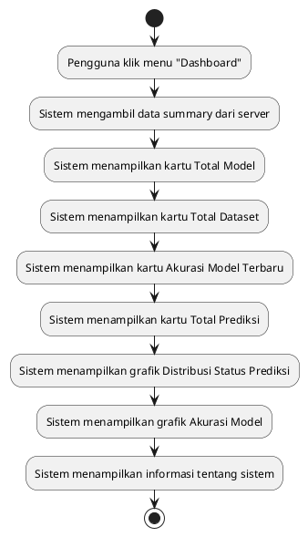
```plantuml
@startuml
start
:Pengguna klik menu "Dashboard";
:Sistem mengambil data summary dari server;
:Sistem menampilkan kartu Total Model;
:Sistem menampilkan kartu Total Dataset;
:Sistem menampilkan kartu Akurasi Model Terbaru;
:Sistem menampilkan kartu Total Prediksi;
:Sistem menampilkan grafik Distribusi Status Prediksi;
:Sistem menampilkan grafik Akurasi Model;
:Sistem menampilkan informasi tentang sistem;
stop
@enduml
```

Sumber: Dokumen Pribadi

#### 4.3.1.5 Sequence Diagram

_Sequence diagram_ memiliki fungsi atau kegunaan untuk menggambarkan aliran fungsionalitas dalam _use case_.

##### a. Sequence Diagram Login

_Sequence diagram_ pada halaman _login_ menjelaskan tentang fungsionalitas pengguna untuk masuk ke sistem. Pada _sequence diagram_ ini pengguna mengisi _username_ dan _password_ secara benar, selanjutnya dapat menekan _button login_ maka akan segera masuk pada halaman dashboard. Berikut adalah gambar dari _Sequence Diagram Login_.

**Gambar 4.11 Sequence Diagram Login**

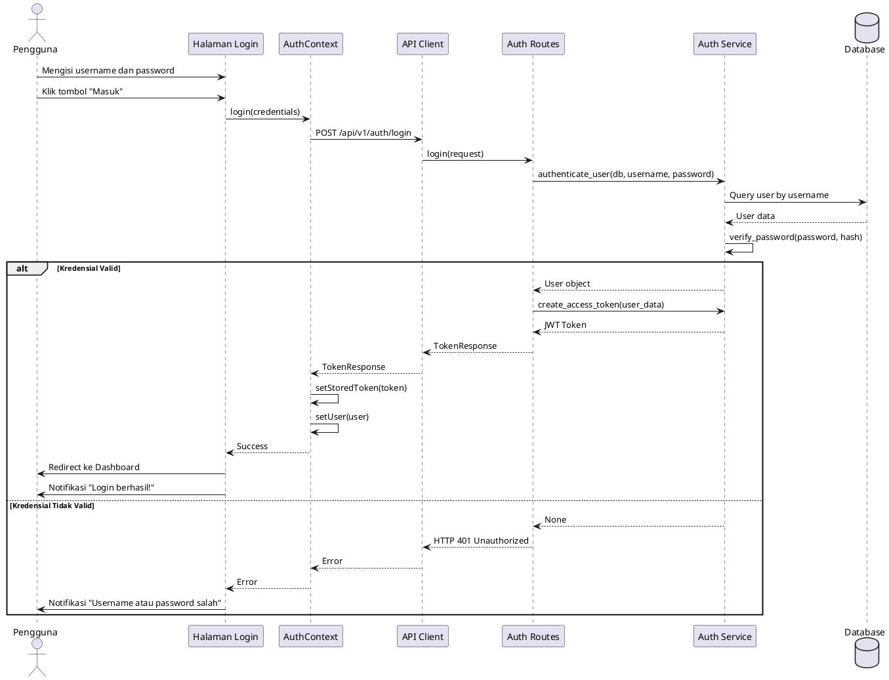
```plantuml
@startuml
actor Pengguna
participant "Halaman Login" as UI
participant "AuthContext" as Auth
participant "API Client" as API
participant "Auth Routes" as Routes
participant "Auth Service" as Service
database "Database" as DB

Pengguna -> UI : Mengisi username dan password
Pengguna -> UI : Klik tombol "Masuk"
UI -> Auth : login(credentials)
Auth -> API : POST /api/v1/auth/login

API -> Routes : login(request)
Routes -> Service : authenticate_user(db, username, password)
Service -> DB : Query user by username
DB --> Service : User data
Service -> Service : verify_password(password, hash)

alt Kredensial Valid
    Service --> Routes : User object
    Routes -> Service : create_access_token(user_data)
    Service --> Routes : JWT Token
    Routes --> API : TokenResponse
    API --> Auth : TokenResponse
    Auth -> Auth : setStoredToken(token)
    Auth -> Auth : setUser(user)
    Auth --> UI : Success
    UI -> Pengguna : Redirect ke Dashboard
    UI -> Pengguna : Notifikasi "Login berhasil!"
else Kredensial Tidak Valid
    Service --> Routes : None
    Routes --> API : HTTP 401 Unauthorized
    API --> Auth : Error
    Auth --> UI : Error
    UI -> Pengguna : Notifikasi "Username atau password salah"
end

@enduml
```

Sumber: Dokumen Pribadi

##### b. Sequence Diagram Logout

_Sequence diagram_ pada halaman _logout_ menjelaskan tentang fungsionalitas pengguna untuk keluar dari sistem. Berikut adalah gambar dari _Sequence Diagram Logout_.

**Gambar 4.12 Sequence Diagram Logout**

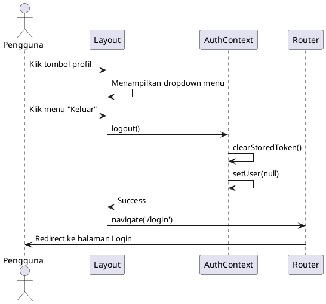
```plantuml
@startuml
actor Pengguna
participant "Layout" as UI
participant "AuthContext" as Auth
participant "Router" as Router

Pengguna -> UI : Klik tombol profil
UI -> UI : Menampilkan dropdown menu
Pengguna -> UI : Klik menu "Keluar"
UI -> Auth : logout()
Auth -> Auth : clearStoredToken()
Auth -> Auth : setUser(null)
Auth --> UI : Success
UI -> Router : navigate('/login')
Router -> Pengguna : Redirect ke halaman Login

@enduml
```

Sumber: Dokumen Pribadi

##### c. Sequence Diagram Membuat Model CART

_Sequence diagram_ pada halaman membuat model menjelaskan tentang fungsionalitas untuk membuat model CART baru dengan mengupload dataset CSV. Berikut adalah gambar dari _Sequence Diagram Membuat Model CART_.

**Gambar 4.13 Sequence Diagram Membuat Model CART**

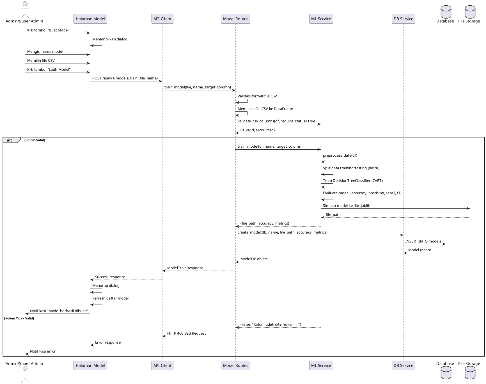
```plantuml
@startuml
actor "Admin/Super Admin" as Pengguna
participant "Halaman Model" as UI
participant "API Client" as API
participant "Model Routes" as Routes
participant "ML Service" as ML
participant "DB Service" as DB
database "Database" as Database
database "File Storage" as Storage

Pengguna -> UI : Klik tombol "Buat Model"
UI -> UI : Menampilkan dialog

Pengguna -> UI : Mengisi nama model
Pengguna -> UI : Memilih file CSV
Pengguna -> UI : Klik tombol "Latih Model"

UI -> API : POST /api/v1/models/train (file, name)
API -> Routes : train_model(file, name, target_column)

Routes -> Routes : Validasi format file CSV
Routes -> Routes : Membaca file CSV ke DataFrame

Routes -> ML : validate_csv_columns(df, require_status=True)
ML --> Routes : (is_valid, error_msg)

alt Kolom Valid
    Routes -> ML : train_model(df, name, target_column)
    ML -> ML : preprocess_data(df)
    ML -> ML : Split data training/testing (80:20)
    ML -> ML : Train DecisionTreeClassifier (CART)
    ML -> ML : Evaluate model (accuracy, precision, recall, f1)
    ML -> Storage : Simpan model ke file .joblib
    Storage --> ML : file_path
    ML --> Routes : {file_path, accuracy, metrics}
    
    Routes -> DB : create_model(db, name, file_path, accuracy, metrics)
    DB -> Database : INSERT INTO models
    Database --> DB : Model record
    DB --> Routes : ModelDB object
    
    Routes --> API : ModelTrainResponse
    API --> UI : Success response
    UI -> UI : Menutup dialog
    UI -> UI : Refresh daftar model
    UI -> Pengguna : Notifikasi "Model berhasil dibuat!"
else Kolom Tidak Valid
    ML --> Routes : (False, "Kolom tidak ditemukan: ...")
    Routes --> API : HTTP 400 Bad Request
    API --> UI : Error response
    UI -> Pengguna : Notifikasi error
end

@enduml
```

Sumber: Dokumen Pribadi

##### d. Sequence Diagram Menghapus Model

_Sequence diagram_ pada halaman menghapus model menjelaskan tentang fungsionalitas untuk menghapus model CART yang tidak diperlukan. Berikut adalah gambar dari _Sequence Diagram Menghapus Model_.

**Gambar 4.14 Sequence Diagram Menghapus Model**

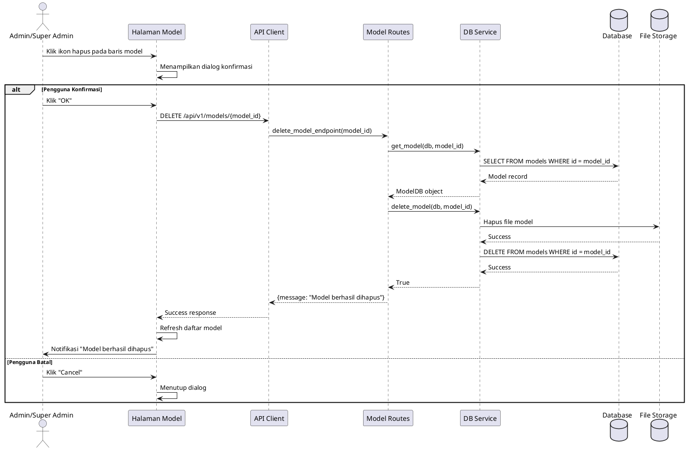
```plantuml
@startuml
actor "Admin/Super Admin" as Pengguna
participant "Halaman Model" as UI
participant "API Client" as API
participant "Model Routes" as Routes
participant "DB Service" as DB
database "Database" as Database
database "File Storage" as Storage

Pengguna -> UI : Klik ikon hapus pada baris model
UI -> UI : Menampilkan dialog konfirmasi

alt Pengguna Konfirmasi
    Pengguna -> UI : Klik "OK"
    UI -> API : DELETE /api/v1/models/{model_id}
    API -> Routes : delete_model_endpoint(model_id)
    
    Routes -> DB : get_model(db, model_id)
    DB -> Database : SELECT FROM models WHERE id = model_id
    Database --> DB : Model record
    DB --> Routes : ModelDB object
    
    Routes -> DB : delete_model(db, model_id)
    DB -> Storage : Hapus file model
    Storage --> DB : Success
    DB -> Database : DELETE FROM models WHERE id = model_id
    Database --> DB : Success
    DB --> Routes : True
    
    Routes --> API : {message: "Model berhasil dihapus"}
    API --> UI : Success response
    UI -> UI : Refresh daftar model
    UI -> Pengguna : Notifikasi "Model berhasil dihapus"
else Pengguna Batal
    Pengguna -> UI : Klik "Cancel"
    UI -> UI : Menutup dialog
end

@enduml
```

Sumber: Dokumen Pribadi

##### e. Sequence Diagram Melakukan Prediksi Tunggal

_Sequence diagram_ pada halaman prediksi tunggal menjelaskan tentang fungsionalitas untuk melakukan prediksi status prestasi untuk satu siswa. Berikut adalah gambar dari _Sequence Diagram Melakukan Prediksi Tunggal_.

**Gambar 4.15 Sequence Diagram Melakukan Prediksi Tunggal**

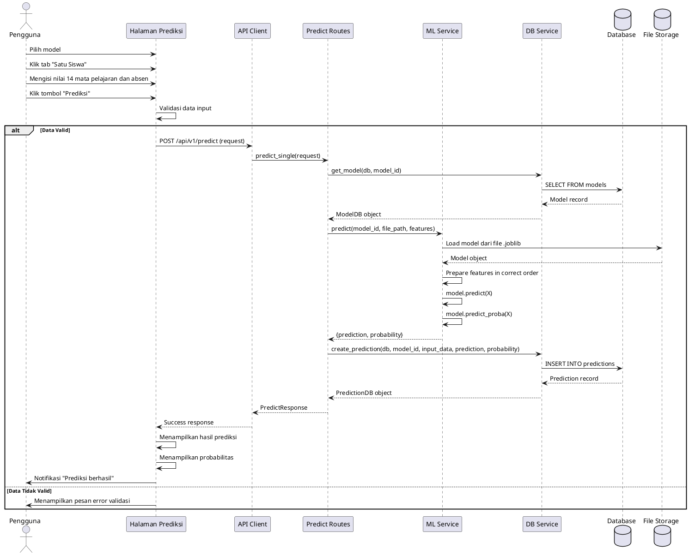
```plantuml
@startuml
actor Pengguna
participant "Halaman Prediksi" as UI
participant "API Client" as API
participant "Predict Routes" as Routes
participant "ML Service" as ML
participant "DB Service" as DB
database "Database" as Database
database "File Storage" as Storage

Pengguna -> UI : Pilih model
Pengguna -> UI : Klik tab "Satu Siswa"
Pengguna -> UI : Mengisi nilai 14 mata pelajaran dan absen
Pengguna -> UI : Klik tombol "Prediksi"

UI -> UI : Validasi data input

alt Data Valid
    UI -> API : POST /api/v1/predict (request)
    API -> Routes : predict_single(request)
    
    Routes -> DB : get_model(db, model_id)
    DB -> Database : SELECT FROM models
    Database --> DB : Model record
    DB --> Routes : ModelDB object
    
    Routes -> ML : predict(model_id, file_path, features)
    ML -> Storage : Load model dari file .joblib
    Storage --> ML : Model object
    ML -> ML : Prepare features in correct order
    ML -> ML : model.predict(X)
    ML -> ML : model.predict_proba(X)
    ML --> Routes : {prediction, probability}
    
    Routes -> DB : create_prediction(db, model_id, input_data, prediction, probability)
    DB -> Database : INSERT INTO predictions
    Database --> DB : Prediction record
    DB --> Routes : PredictionDB object
    
    Routes --> API : PredictResponse
    API --> UI : Success response
    UI -> UI : Menampilkan hasil prediksi
    UI -> UI : Menampilkan probabilitas
    UI -> Pengguna : Notifikasi "Prediksi berhasil"
else Data Tidak Valid
    UI -> Pengguna : Menampilkan pesan error validasi
end

@enduml
```

Sumber: Dokumen Pribadi

##### f. Sequence Diagram Melakukan Prediksi Batch

_Sequence diagram_ pada halaman prediksi batch menjelaskan tentang fungsionalitas untuk melakukan prediksi status prestasi untuk banyak siswa sekaligus. Berikut adalah gambar dari _Sequence Diagram Melakukan Prediksi Batch_.

**Gambar 4.16 Sequence Diagram Melakukan Prediksi Batch**

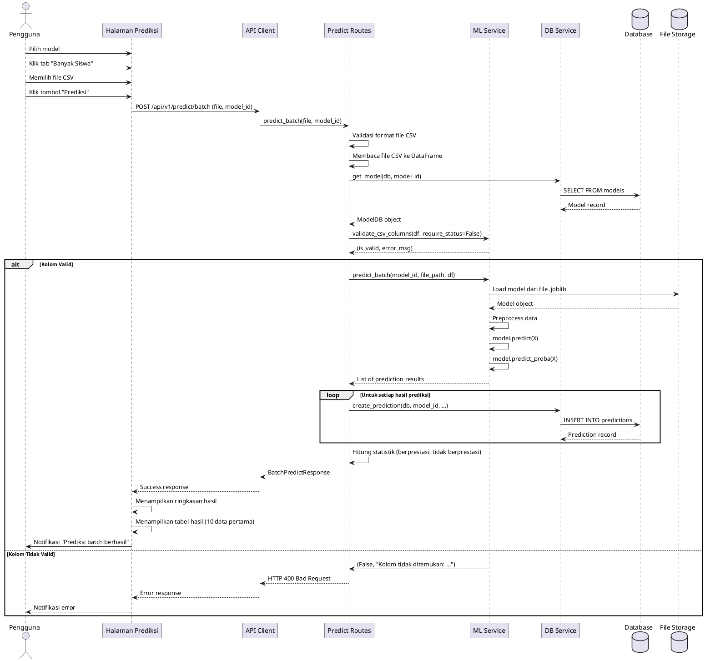
```plantuml
@startuml
actor Pengguna
participant "Halaman Prediksi" as UI
participant "API Client" as API
participant "Predict Routes" as Routes
participant "ML Service" as ML
participant "DB Service" as DB
database "Database" as Database
database "File Storage" as Storage

Pengguna -> UI : Pilih model
Pengguna -> UI : Klik tab "Banyak Siswa"
Pengguna -> UI : Memilih file CSV
Pengguna -> UI : Klik tombol "Prediksi"

UI -> API : POST /api/v1/predict/batch (file, model_id)
API -> Routes : predict_batch(file, model_id)

Routes -> Routes : Validasi format file CSV
Routes -> Routes : Membaca file CSV ke DataFrame

Routes -> DB : get_model(db, model_id)
DB -> Database : SELECT FROM models
Database --> DB : Model record
DB --> Routes : ModelDB object

Routes -> ML : validate_csv_columns(df, require_status=False)
ML --> Routes : (is_valid, error_msg)

alt Kolom Valid
    Routes -> ML : predict_batch(model_id, file_path, df)
    ML -> Storage : Load model dari file .joblib
    Storage --> ML : Model object
    ML -> ML : Preprocess data
    ML -> ML : model.predict(X)
    ML -> ML : model.predict_proba(X)
    ML --> Routes : List of prediction results
    
    loop Untuk setiap hasil prediksi
        Routes -> DB : create_prediction(db, model_id, ...)
        DB -> Database : INSERT INTO predictions
        Database --> DB : Prediction record
    end
    
    Routes -> Routes : Hitung statistik (berprestasi, tidak berprestasi)
    Routes --> API : BatchPredictResponse
    API --> UI : Success response
    UI -> UI : Menampilkan ringkasan hasil
    UI -> UI : Menampilkan tabel hasil (10 data pertama)
    UI -> Pengguna : Notifikasi "Prediksi batch berhasil"
else Kolom Tidak Valid
    ML --> Routes : (False, "Kolom tidak ditemukan: ...")
    Routes --> API : HTTP 400 Bad Request
    API --> UI : Error response
    UI -> Pengguna : Notifikasi error
end

@enduml
```

Sumber: Dokumen Pribadi

##### g. Sequence Diagram Menambah User

_Sequence diagram_ pada halaman menambah user menjelaskan tentang fungsionalitas untuk menambahkan user baru ke sistem. Berikut adalah gambar dari _Sequence Diagram Menambah User_.

**Gambar 4.17 Sequence Diagram Menambah User**

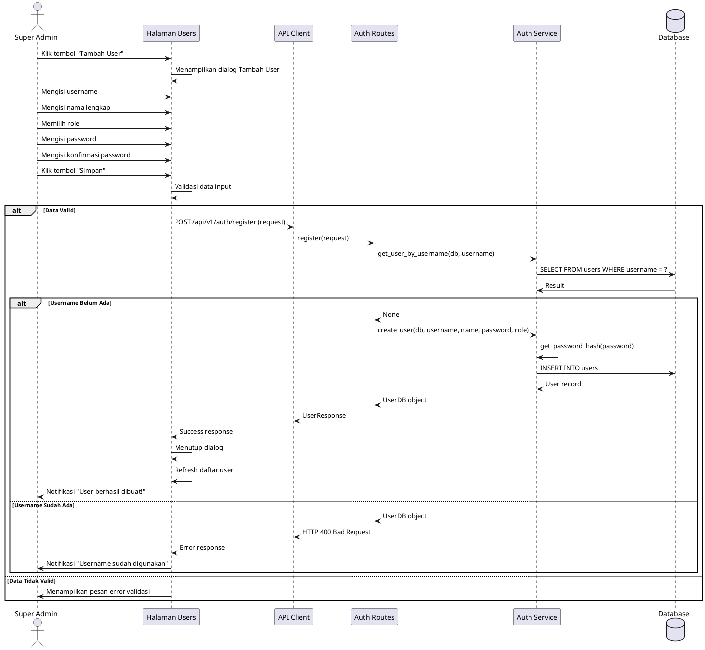
```plantuml
@startuml
actor "Super Admin" as Pengguna
participant "Halaman Users" as UI
participant "API Client" as API
participant "Auth Routes" as Routes
participant "Auth Service" as Service
database "Database" as Database

Pengguna -> UI : Klik tombol "Tambah User"
UI -> UI : Menampilkan dialog Tambah User

Pengguna -> UI : Mengisi username
Pengguna -> UI : Mengisi nama lengkap
Pengguna -> UI : Memilih role
Pengguna -> UI : Mengisi password
Pengguna -> UI : Mengisi konfirmasi password
Pengguna -> UI : Klik tombol "Simpan"

UI -> UI : Validasi data input

alt Data Valid
    UI -> API : POST /api/v1/auth/register (request)
    API -> Routes : register(request)
    
    Routes -> Service : get_user_by_username(db, username)
    Service -> Database : SELECT FROM users WHERE username = ?
    Database --> Service : Result
    
    alt Username Belum Ada
        Service --> Routes : None
        Routes -> Service : create_user(db, username, name, password, role)
        Service -> Service : get_password_hash(password)
        Service -> Database : INSERT INTO users
        Database --> Service : User record
        Service --> Routes : UserDB object
        
        Routes --> API : UserResponse
        API --> UI : Success response
        UI -> UI : Menutup dialog
        UI -> UI : Refresh daftar user
        UI -> Pengguna : Notifikasi "User berhasil dibuat!"
    else Username Sudah Ada
        Service --> Routes : UserDB object
        Routes --> API : HTTP 400 Bad Request
        API --> UI : Error response
        UI -> Pengguna : Notifikasi "Username sudah digunakan"
    end
else Data Tidak Valid
    UI -> Pengguna : Menampilkan pesan error validasi
end

@enduml
```

Sumber: Dokumen Pribadi

##### h. Sequence Diagram Mengedit User

_Sequence diagram_ pada halaman mengedit user menjelaskan tentang fungsionalitas untuk mengubah informasi user yang ada. Berikut adalah gambar dari _Sequence Diagram Mengedit User_.

**Gambar 4.18 Sequence Diagram Mengedit User**

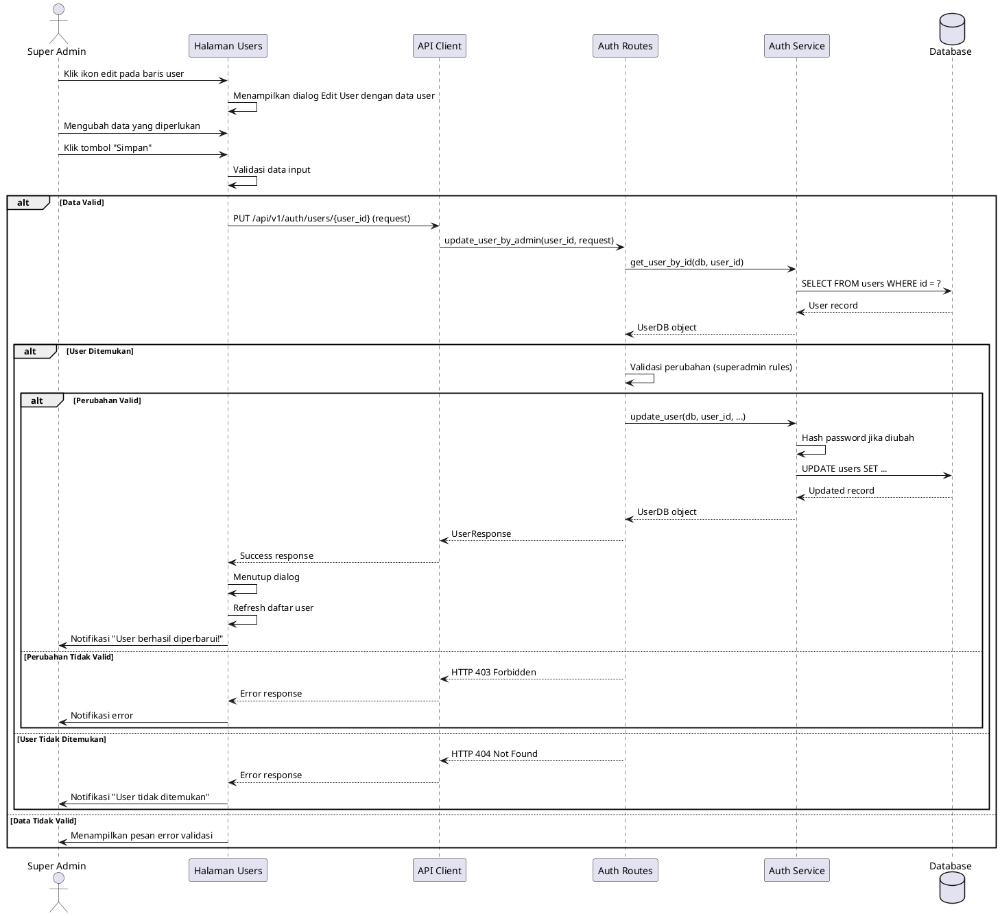
```plantuml
@startuml
actor "Super Admin" as Pengguna
participant "Halaman Users" as UI
participant "API Client" as API
participant "Auth Routes" as Routes
participant "Auth Service" as Service
database "Database" as Database

Pengguna -> UI : Klik ikon edit pada baris user
UI -> UI : Menampilkan dialog Edit User dengan data user

Pengguna -> UI : Mengubah data yang diperlukan
Pengguna -> UI : Klik tombol "Simpan"

UI -> UI : Validasi data input

alt Data Valid
    UI -> API : PUT /api/v1/auth/users/{user_id} (request)
    API -> Routes : update_user_by_admin(user_id, request)
    
    Routes -> Service : get_user_by_id(db, user_id)
    Service -> Database : SELECT FROM users WHERE id = ?
    Database --> Service : User record
    Service --> Routes : UserDB object
    
    alt User Ditemukan
        Routes -> Routes : Validasi perubahan (superadmin rules)
        
        alt Perubahan Valid
            Routes -> Service : update_user(db, user_id, ...)
            Service -> Service : Hash password jika diubah
            Service -> Database : UPDATE users SET ...
            Database --> Service : Updated record
            Service --> Routes : UserDB object
            
            Routes --> API : UserResponse
            API --> UI : Success response
            UI -> UI : Menutup dialog
            UI -> UI : Refresh daftar user
            UI -> Pengguna : Notifikasi "User berhasil diperbarui!"
        else Perubahan Tidak Valid
            Routes --> API : HTTP 403 Forbidden
            API --> UI : Error response
            UI -> Pengguna : Notifikasi error
        end
    else User Tidak Ditemukan
        Routes --> API : HTTP 404 Not Found
        API --> UI : Error response
        UI -> Pengguna : Notifikasi "User tidak ditemukan"
    end
else Data Tidak Valid
    UI -> Pengguna : Menampilkan pesan error validasi
end

@enduml
```

Sumber: Dokumen Pribadi

##### i. Sequence Diagram Menghapus User

_Sequence diagram_ pada halaman menghapus user menjelaskan tentang fungsionalitas untuk menghapus user dari sistem. Berikut adalah gambar dari _Sequence Diagram Menghapus User_.

**Gambar 4.19 Sequence Diagram Menghapus User**

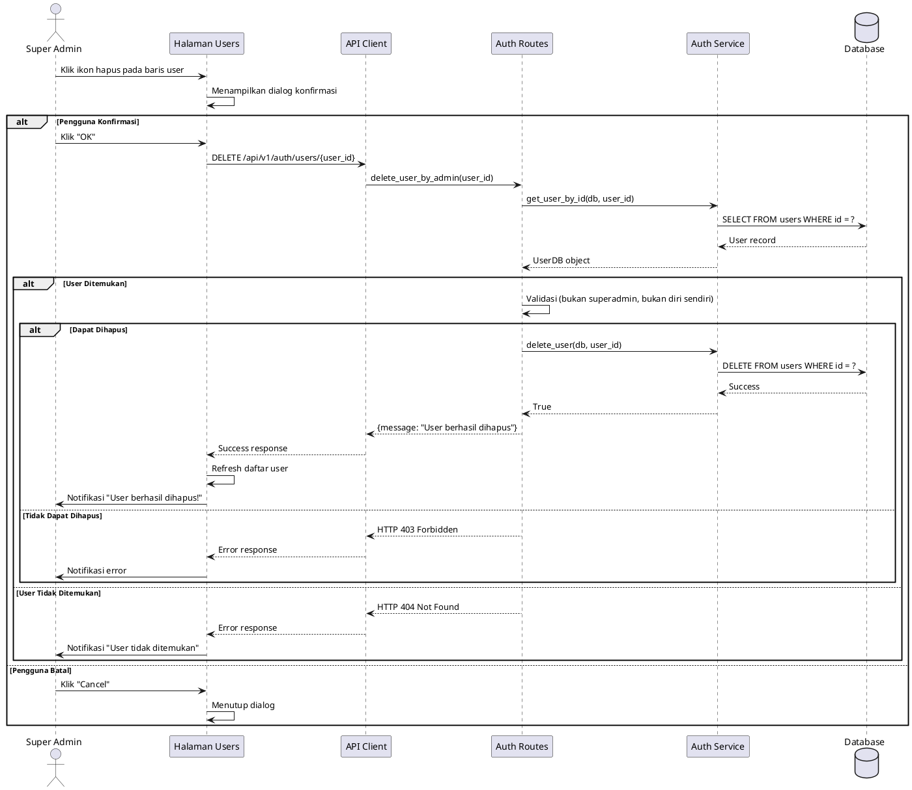
```plantuml
@startuml
actor "Super Admin" as Pengguna
participant "Halaman Users" as UI
participant "API Client" as API
participant "Auth Routes" as Routes
participant "Auth Service" as Service
database "Database" as Database

Pengguna -> UI : Klik ikon hapus pada baris user
UI -> UI : Menampilkan dialog konfirmasi

alt Pengguna Konfirmasi
    Pengguna -> UI : Klik "OK"
    UI -> API : DELETE /api/v1/auth/users/{user_id}
    API -> Routes : delete_user_by_admin(user_id)
    
    Routes -> Service : get_user_by_id(db, user_id)
    Service -> Database : SELECT FROM users WHERE id = ?
    Database --> Service : User record
    Service --> Routes : UserDB object
    
    alt User Ditemukan
        Routes -> Routes : Validasi (bukan superadmin, bukan diri sendiri)
        
        alt Dapat Dihapus
            Routes -> Service : delete_user(db, user_id)
            Service -> Database : DELETE FROM users WHERE id = ?
            Database --> Service : Success
            Service --> Routes : True
            
            Routes --> API : {message: "User berhasil dihapus"}
            API --> UI : Success response
            UI -> UI : Refresh daftar user
            UI -> Pengguna : Notifikasi "User berhasil dihapus!"
        else Tidak Dapat Dihapus
            Routes --> API : HTTP 403 Forbidden
            API --> UI : Error response
            UI -> Pengguna : Notifikasi error
        end
    else User Tidak Ditemukan
        Routes --> API : HTTP 404 Not Found
        API --> UI : Error response
        UI -> Pengguna : Notifikasi "User tidak ditemukan"
    end
else Pengguna Batal
    Pengguna -> UI : Klik "Cancel"
    UI -> UI : Menutup dialog
end

@enduml
```

Sumber: Dokumen Pribadi

##### j. Sequence Diagram Melihat Dashboard

_Sequence diagram_ pada halaman dashboard menjelaskan tentang fungsionalitas untuk melihat ringkasan statistik sistem. Berikut adalah gambar dari _Sequence Diagram Melihat Dashboard_.

**Gambar 4.20 Sequence Diagram Melihat Dashboard**

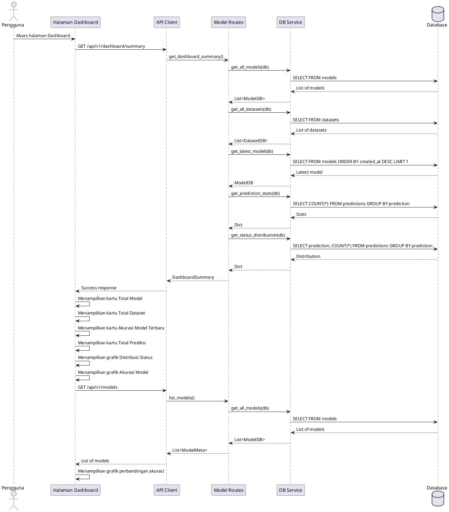
```plantuml
@startuml
actor Pengguna
participant "Halaman Dashboard" as UI
participant "API Client" as API
participant "Model Routes" as Routes
participant "DB Service" as DB
database "Database" as Database

Pengguna -> UI : Akses halaman Dashboard

UI -> API : GET /api/v1/dashboard/summary
API -> Routes : get_dashboard_summary()

Routes -> DB : get_all_models(db)
DB -> Database : SELECT FROM models
Database --> DB : List of models
DB --> Routes : List<ModelDB>

Routes -> DB : get_all_datasets(db)
DB -> Database : SELECT FROM datasets
Database --> DB : List of datasets
DB --> Routes : List<DatasetDB>

Routes -> DB : get_latest_model(db)
DB -> Database : SELECT FROM models ORDER BY created_at DESC LIMIT 1
Database --> DB : Latest model
DB --> Routes : ModelDB

Routes -> DB : get_prediction_stats(db)
DB -> Database : SELECT COUNT(*) FROM predictions GROUP BY prediction
Database --> DB : Stats
DB --> Routes : Dict

Routes -> DB : get_status_distribution(db)
DB -> Database : SELECT prediction, COUNT(*) FROM predictions GROUP BY prediction
Database --> DB : Distribution
DB --> Routes : Dict

Routes --> API : DashboardSummary
API --> UI : Success response

UI -> UI : Menampilkan kartu Total Model
UI -> UI : Menampilkan kartu Total Dataset
UI -> UI : Menampilkan kartu Akurasi Model Terbaru
UI -> UI : Menampilkan kartu Total Prediksi
UI -> UI : Menampilkan grafik Distribusi Status
UI -> UI : Menampilkan grafik Akurasi Model

UI -> API : GET /api/v1/models
API -> Routes : list_models()
Routes -> DB : get_all_models(db)
DB -> Database : SELECT FROM models
Database --> DB : List of models
DB --> Routes : List<ModelDB>
Routes --> API : List<ModelMeta>
API --> UI : List of models

UI -> UI : Menampilkan grafik perbandingan akurasi

@enduml
```

Sumber: Dokumen Pribadi

### 4.3.2 Rancangan Layar

Berikut rancangan layar aplikasi Sistem Prediksi Siswa Berprestasi di SMP PGRI Tambun Selatan menggunakan metode CART:

#### a. Rancangan Layar Login

Halaman login merupakan tampilan awal aplikasi yang menampilkan form untuk pengguna masuk ke sistem. Pengguna harus mengisi username dan password yang valid untuk mengakses aplikasi.

**Gambar 4.21 Rancangan Layar Login**

_Keterangan: Halaman login menampilkan logo aplikasi, judul "CART Prediction", form input username dan password dengan tombol show/hide password, serta tombol "Masuk". Di bagian bawah terdapat informasi "SMP PGRI Tambun Selatan" dan "Metode CART untuk Menentukan Siswa Berprestasi"._

#### b. Rancangan Layar Dashboard

Halaman dashboard menampilkan ringkasan statistik sistem setelah pengguna berhasil login.

**Gambar 4.22 Rancangan Layar Dashboard**

_Keterangan: Halaman dashboard menampilkan header dengan navigasi (Dashboard, Model, Prediksi, Users untuk Super Admin) dan menu profil pengguna. Konten utama berisi 4 kartu statistik (Total Model, Total Dataset, Akurasi Model Terbaru, Total Prediksi), grafik pie chart Distribusi Status Prediksi, grafik progress bar Akurasi Model, dan informasi tentang sistem._

#### c. Rancangan Layar Manajemen Model

Halaman manajemen model menampilkan daftar model CART yang telah dibuat beserta aksi yang dapat dilakukan.

**Gambar 4.23 Rancangan Layar Manajemen Model**

_Keterangan: Halaman model menampilkan header dengan tombol "Download Template" dan "Buat Model" (untuk Admin/Super Admin). Tabel daftar model berisi kolom: Nama Model, Akurasi, Precision, Recall, Dataset, Tanggal Dibuat, dan Aksi (hapus untuk Admin/Super Admin)._

#### d. Rancangan Layar Prediksi Siswa

Halaman prediksi siswa menampilkan form untuk melakukan prediksi tunggal atau batch.

**Gambar 4.24 Rancangan Layar Prediksi Siswa**

_Keterangan: Halaman prediksi menampilkan dropdown pemilihan model, tab "Satu Siswa" dan "Banyak Siswa". Tab Satu Siswa berisi form input nama siswa dan 14 field nilai mata pelajaran serta absen. Tab Banyak Siswa berisi form upload file CSV dan tombol "Download Template". Hasil prediksi ditampilkan di bagian bawah._

#### e. Rancangan Layar Manajemen User

Halaman manajemen user menampilkan daftar user dan aksi pengelolaan user (hanya untuk Super Admin).

**Gambar 4.25 Rancangan Layar Manajemen User**

_Keterangan: Halaman users menampilkan header dengan tombol "Tambah User". Tabel daftar user berisi kolom: Username, Nama, Role (dengan badge warna berbeda), Tanggal Dibuat, dan Aksi (edit, hapus)._

### 4.3.3 Tampilan Layar

Berikut tampilan layar aplikasi Sistem Prediksi Siswa Berprestasi di SMP PGRI Tambun Selatan menggunakan metode CART:

#### a. Tampilan Layar Login

**Gambar 4.26 Tampilan Layar Login**

_Pada Gambar 4.26 merupakan tampilan login untuk masuk ke dalam aplikasi. Pengguna diharuskan untuk mengisi username dan password. Terdapat tombol show/hide password dan tombol "Masuk". Jika kredensial salah maka akan muncul notifikasi error._

#### b. Tampilan Layar Dashboard

**Gambar 4.27 Tampilan Layar Dashboard**

_Pada Gambar 4.27 merupakan tampilan dashboard yang menampilkan ringkasan statistik sistem meliputi Total Model, Total Dataset, Akurasi Model Terbaru, Total Prediksi, grafik distribusi status prediksi, dan grafik akurasi model._

#### c. Tampilan Layar Manajemen Model

**Gambar 4.28 Tampilan Layar Manajemen Model**

_Pada Gambar 4.28 merupakan tampilan halaman manajemen model yang menampilkan daftar model CART beserta metrik evaluasi. Admin dan Super Admin dapat membuat model baru dan menghapus model yang ada._

#### d. Tampilan Layar Buat Model Baru

**Gambar 4.29 Tampilan Layar Buat Model Baru**

_Pada Gambar 4.29 merupakan tampilan dialog untuk membuat model CART baru. Pengguna dapat mengisi nama model dan mengupload file CSV dataset. Terdapat informasi format CSV yang diperlukan._

#### e. Tampilan Layar Prediksi Tunggal

**Gambar 4.30 Tampilan Layar Prediksi Tunggal**

_Pada Gambar 4.30 merupakan tampilan prediksi untuk satu siswa. Pengguna memilih model, mengisi nama siswa dan nilai 14 mata pelajaran serta jumlah absen. Hasil prediksi menampilkan status (Berprestasi/Tidak Berprestasi) beserta probabilitas._

#### f. Tampilan Layar Prediksi Batch

**Gambar 4.31 Tampilan Layar Prediksi Batch**

_Pada Gambar 4.31 merupakan tampilan prediksi untuk banyak siswa sekaligus. Pengguna memilih model dan mengupload file CSV. Hasil menampilkan ringkasan (total, berprestasi, tidak berprestasi) dan tabel hasil prediksi dengan opsi download._

#### g. Tampilan Layar Manajemen User

**Gambar 4.32 Tampilan Layar Manajemen User**

_Pada Gambar 4.32 merupakan tampilan halaman manajemen user yang hanya dapat diakses oleh Super Admin. Menampilkan daftar user dengan role berbeda (Super Admin, Admin, User) beserta aksi edit dan hapus._

#### h. Tampilan Layar Tambah User

**Gambar 4.33 Tampilan Layar Tambah User**

_Pada Gambar 4.33 merupakan tampilan dialog untuk menambah user baru. Super Admin dapat mengisi username, nama lengkap, memilih role, dan mengisi password._

#### i. Tampilan Layar Edit Profil

**Gambar 4.34 Tampilan Layar Edit Profil**

_Pada Gambar 4.34 merupakan tampilan dialog untuk mengedit profil pengguna. Pengguna dapat mengubah nama dan password._

## 4.4 Kelebihan dan Kekurangan Penelitian

### 4.4.1 Kelebihan Penelitian

Penelitian ini memiliki beberapa kelebihan yang menjadi nilai tambah bagi pengembangan ilmu maupun praktik di lapangan sebagai berikut:

1. Penelitian menggunakan metode Classification and Regression Tree (CART) yang efektif untuk klasifikasi data dengan interpretasi model yang mudah dipahami berupa pohon keputusan.

2. Sistem yang dibangun berbasis web dengan arsitektur modern (React + FastAPI) sehingga dapat diakses dari berbagai perangkat melalui browser.

3. Terdapat fitur prediksi batch yang memungkinkan prediksi banyak siswa sekaligus, meningkatkan efisiensi proses penentuan siswa berprestasi.

4. Sistem memiliki manajemen role-based access control (RBAC) dengan tiga level (Super Admin, Admin, User) untuk keamanan dan pembagian akses yang jelas.

5. Model yang dihasilkan memiliki metrik evaluasi lengkap (accuracy, precision, recall, F1-score) sehingga performa model dapat diukur secara objektif.

6. Dashboard menyajikan visualisasi data yang informatif untuk membantu pengambilan keputusan.

### 4.4.2 Kelemahan Penelitian

Penelitian ini juga memiliki beberapa kelemahan yang perlu diperhatikan sebagai berikut:

1. Penelitian hanya dilakukan pada satu objek yaitu SMP PGRI Tambun Selatan, sehingga hasil yang diperoleh belum dapat digeneralisasikan untuk seluruh sekolah.

2. Fitur yang digunakan sebagai input model terbatas pada 14 fitur (13 mata pelajaran + absen), belum mempertimbangkan faktor lain seperti kondisi sosial ekonomi, keaktifan ekstrakurikuler, atau prestasi non-akademik.

3. Metode CART yang digunakan memiliki kecenderungan overfitting pada data training, sehingga perlu pengaturan hyperparameter yang tepat.

4. Sistem belum memiliki fitur untuk melakukan cross-validation atau hyperparameter tuning secara otomatis.

5. Belum terdapat fitur untuk membandingkan performa antar model secara langsung dalam satu tampilan.

Berdasarkan keterbatasan yang ada, beberapa saran dapat diberikan untuk penelitian selanjutnya sebagai berikut:

1. Penelitian serupa sebaiknya dilakukan dengan cakupan lebih luas pada beberapa sekolah lain agar hasilnya lebih representatif dan dapat dibandingkan.

2. Jumlah fitur dapat ditambahkan dengan mempertimbangkan faktor non-akademik seperti keaktifan organisasi, prestasi lomba, dan lainnya.

3. Dapat dikembangkan fitur perbandingan model dan hyperparameter tuning untuk menghasilkan model dengan performa optimal.

4. Bagi pihak sekolah, hasil penelitian ini dapat dijadikan acuan dalam mengidentifikasi siswa berprestasi secara objektif dan konsisten.

