# 📚 Buku Panduan Pengguna SIPRESTA

## Sistem Prediksi Prestasi Siswa

---

# 📖 Daftar Isi

- [📚 Buku Panduan Pengguna SIPRESTA](#-buku-panduan-pengguna-sipresta)
  - [Sistem Prediksi Prestasi Siswa](#sistem-prediksi-prestasi-siswa)
- [📖 Daftar Isi](#-daftar-isi)
- [1. Pendahuluan](#1-pendahuluan)
  - [1.1 Apa itu SIPRESTA?](#11-apa-itu-sipresta)
    - [✅ Manfaat SIPRESTA:](#-manfaat-sipresta)
  - [1.2 Siapa yang Menggunakan SIPRESTA?](#12-siapa-yang-menggunakan-sipresta)
  - [1.3 Tingkatan Pengguna (Role)](#13-tingkatan-pengguna-role)
    - [🔑 Super Admin](#-super-admin)
    - [🔑 Admin](#-admin)
    - [🔑 User (Pengguna Biasa)](#-user-pengguna-biasa)
- [2. Memulai Penggunaan](#2-memulai-penggunaan)
  - [2.1 Masuk ke Sistem (Login)](#21-masuk-ke-sistem-login)
    - [Langkah-langkah Login:](#langkah-langkah-login)
    - [Pesan Error yang Mungkin Muncul:](#pesan-error-yang-mungkin-muncul)
  - [2.2 Navigasi Aplikasi](#22-navigasi-aplikasi)
    - [Menu Utama:](#menu-utama)
    - [Fitur Navigasi Tambahan:](#fitur-navigasi-tambahan)
  - [2.3 Keluar dari Sistem (Logout)](#23-keluar-dari-sistem-logout)
    - [Langkah-langkah Logout:](#langkah-langkah-logout)
- [3. Dashboard](#3-dashboard)
  - [3.1 Memahami Dashboard](#31-memahami-dashboard)
  - [3.2 Statistik Utama](#32-statistik-utama)
    - [📊 Total Model](#-total-model)
    - [📂 Total Dataset](#-total-dataset)
    - [🎯 Akurasi Model Terbaru](#-akurasi-model-terbaru)
    - [📈 Total Prediksi](#-total-prediksi)
  - [3.3 Grafik Distribusi Prediksi](#33-grafik-distribusi-prediksi)
    - [Cara Membaca Grafik:](#cara-membaca-grafik)
  - [3.4 Informasi Akurasi Model](#34-informasi-akurasi-model)
    - [Tentang Sistem](#tentang-sistem)
- [4. Manajemen Model](#4-manajemen-model)
  - [4.1 Melihat Daftar Model](#41-melihat-daftar-model)
    - [Langkah-langkah:](#langkah-langkah)
    - [Informasi yang Tersedia:](#informasi-yang-tersedia)
  - [4.2 Membuat Model Baru](#42-membuat-model-baru)
    - [Langkah-langkah Membuat Model:](#langkah-langkah-membuat-model)
    - [Format CSV yang Diperlukan](#format-csv-yang-diperlukan)
  - [4.3 Mengedit Nama Model](#43-mengedit-nama-model)
    - [Langkah-langkah:](#langkah-langkah-1)
  - [4.4 Menghapus Model](#44-menghapus-model)
    - [Langkah-langkah:](#langkah-langkah-2)
  - [4.5 Download Template CSV](#45-download-template-csv)
    - [Langkah-langkah:](#langkah-langkah-3)
- [5. Prediksi Siswa](#5-prediksi-siswa)
  - [5.1 Prediksi Satu Siswa](#51-prediksi-satu-siswa)
    - [Langkah-langkah:](#langkah-langkah-4)
    - [Memahami Hasil Prediksi:](#memahami-hasil-prediksi)
  - [5.2 Prediksi Banyak Siswa (Batch)](#52-prediksi-banyak-siswa-batch)
    - [Langkah-langkah:](#langkah-langkah-5)
    - [Format CSV untuk Prediksi Massal:](#format-csv-untuk-prediksi-massal)
  - [5.3 Memahami Hasil Prediksi](#53-memahami-hasil-prediksi)
    - [Interpretasi Hasil:](#interpretasi-hasil)
- [6. Manajemen Pengguna (Super Admin)](#6-manajemen-pengguna-super-admin)
  - [6.1 Melihat Daftar Pengguna](#61-melihat-daftar-pengguna)
    - [Langkah-langkah:](#langkah-langkah-6)
    - [Informasi yang Tersedia:](#informasi-yang-tersedia-1)
    - [Badge Role:](#badge-role)
  - [6.2 Menambah Pengguna Baru](#62-menambah-pengguna-baru)
    - [Langkah-langkah:](#langkah-langkah-7)
  - [6.3 Mengedit Pengguna](#63-mengedit-pengguna)
    - [Langkah-langkah:](#langkah-langkah-8)
  - [6.4 Menghapus Pengguna](#64-menghapus-pengguna)
    - [Langkah-langkah:](#langkah-langkah-9)
- [7. Pengaturan Profil](#7-pengaturan-profil)
  - [7.1 Mengedit Profil](#71-mengedit-profil)
    - [Langkah-langkah:](#langkah-langkah-10)
  - [7.2 Mengubah Password](#72-mengubah-password)
    - [Langkah-langkah:](#langkah-langkah-11)
- [8. Panduan Cepat](#8-panduan-cepat)
  - [🚀 Quick Start Guide (5 Menit)](#-quick-start-guide-5-menit)
    - [1️⃣ Login ke Sistem](#1️⃣-login-ke-sistem)
    - [2️⃣ Lihat Dashboard](#2️⃣-lihat-dashboard)
    - [3️⃣ Lakukan Prediksi Pertama](#3️⃣-lakukan-prediksi-pertama)
    - [4️⃣ Logout dengan Aman](#4️⃣-logout-dengan-aman)
  - [⌨️ Navigasi Cepat](#️-navigasi-cepat)
- [9. Troubleshooting \& FAQ](#9-troubleshooting--faq)
  - [❓ Pertanyaan Umum (FAQ)](#-pertanyaan-umum-faq)
    - [Q: Saya lupa password, bagaimana cara reset?](#q-saya-lupa-password-bagaimana-cara-reset)
    - [Q: Mengapa saya tidak bisa melihat menu "Users"?](#q-mengapa-saya-tidak-bisa-melihat-menu-users)
    - [Q: Berapa akurasi model yang dianggap baik?](#q-berapa-akurasi-model-yang-dianggap-baik)
    - [Q: Apakah hasil prediksi selalu akurat?](#q-apakah-hasil-prediksi-selalu-akurat)
    - [Q: Format CSV seperti apa yang harus saya gunakan?](#q-format-csv-seperti-apa-yang-harus-saya-gunakan)
    - [Q: Bisakah saya menghapus model yang sudah dibuat?](#q-bisakah-saya-menghapus-model-yang-sudah-dibuat)
    - [Q: Bagaimana cara logout dari sistem?](#q-bagaimana-cara-logout-dari-sistem)
  - [🔧 Troubleshooting](#-troubleshooting)
    - [Problem: Login gagal](#problem-login-gagal)
    - [Problem: File CSV ditolak](#problem-file-csv-ditolak)
    - [Problem: Prediksi tidak berjalan](#problem-prediksi-tidak-berjalan)
  - [📞 Bantuan Lebih Lanjut](#-bantuan-lebih-lanjut)
- [10. Glosarium](#10-glosarium)
- [📝 Catatan Pembaruan](#-catatan-pembaruan)

---

# 1. Pendahuluan

## 1.1 Apa itu SIPRESTA?

**SIPRESTA (Sistem Prediksi Prestasi Siswa)** adalah aplikasi berbasis web yang dirancang untuk membantu sekolah memprediksi status prestasi siswa berdasarkan nilai mata pelajaran dan data kehadiran. Sistem ini menggunakan metode **CART (Classification and Regression Tree)** untuk menganalisis data siswa dan memberikan prediksi apakah seorang siswa berpotensi **berprestasi** atau **tidak berprestasi**.

### ✅ Manfaat SIPRESTA:

- Membantu guru mengidentifikasi siswa yang membutuhkan perhatian khusus
- Memberikan data statistik untuk pengambilan keputusan akademik
- Mempermudah analisis performa siswa secara massal
- Menyediakan visualisasi data yang mudah dipahami

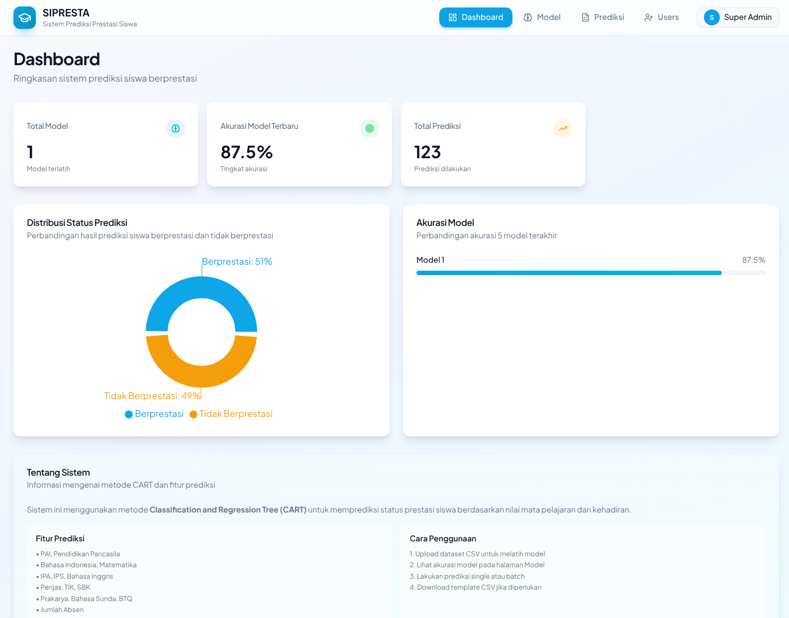

<!-- 📸 IMAGE NEEDED:
     URL: / (Dashboard)
     Show: Tampilan dashboard lengkap dengan header navigasi, 4 kartu statistik, grafik pie chart distribusi prediksi, dan grafik bar akurasi model
     Highlight: Logo SIPRESTA dan navigasi utama di bagian atas
     State: Setelah login sebagai Super Admin
     Notes: Tampilkan dalam kondisi default dengan data contoh
-->

## 1.2 Siapa yang Menggunakan SIPRESTA?

SIPRESTA dirancang untuk digunakan oleh:

| Pengguna                                  | Kegunaan                                                     |
| ----------------------------------------- | ------------------------------------------------------------ |
| **Kepala Sekolah**                        | Melihat statistik dan tren prestasi siswa secara keseluruhan |
| **Wakil Kepala Sekolah Bidang Kurikulum** | Menganalisis efektivitas program pembelajaran                |
| **Guru Bimbingan Konseling (BK)**         | Mengidentifikasi siswa yang memerlukan bimbingan             |
| **Wali Kelas**                            | Memantau perkembangan prestasi siswa di kelasnya             |
| **Administrator Sekolah**                 | Mengelola data dan pengguna sistem                           |

## 1.3 Tingkatan Pengguna (Role)

SIPRESTA memiliki 3 tingkatan pengguna dengan hak akses berbeda:

### 🔑 Super Admin

- ✅ Akses penuh ke semua fitur
- ✅ Dapat mengelola pengguna (tambah, edit, hapus)
- ✅ Dapat membuat dan mengelola model prediksi
- ✅ Dapat melakukan prediksi siswa

### 🔑 Admin

- ✅ Dapat melihat dashboard
- ✅ Dapat membuat dan mengelola model prediksi
- ✅ Dapat melakukan prediksi siswa
- ❌ **Tidak dapat** mengelola pengguna

### 🔑 User (Pengguna Biasa)

- ✅ Dapat melihat dashboard
- ✅ Dapat membuat dan mengelola model prediksi
- ✅ Dapat melakukan prediksi siswa
- ❌ **Tidak dapat** mengelola pengguna

<!-- 📸 IMAGE NEEDED:
     URL: / (Dashboard)
     Show: Tiga screenshot berdampingan menunjukkan menu navigasi untuk Super Admin (dengan menu Users), Admin (tanpa menu Users), dan User (tanpa menu Users)
     Highlight: Perbedaan pada menu navigasi
     State: Masing-masing login dengan role berbeda
-->

---

# 2. Memulai Penggunaan

## 2.1 Masuk ke Sistem (Login)

Untuk mulai menggunakan SIPRESTA, Anda perlu masuk dengan akun yang telah diberikan oleh administrator.

### Langkah-langkah Login:

**Langkah 1:** Buka browser dan akses alamat SIPRESTA


<!-- 📸 IMAGE NEEDED:
     URL: /login
     Show: Halaman login dengan form username dan password, tombol show/hide password, dan tombol Masuk
     Highlight: Form login di tengah halaman
     State: Halaman login kosong sebelum input
     Notes: Tampilkan desain bersih dengan latar belakang gradient
-->

**Langkah 2:** Masukkan **Username** Anda pada kolom yang tersedia


<!-- 📸 IMAGE NEEDED:
     URL: /login
     Show: Halaman login dengan username terisi "user@example.com"
     Highlight: Kolom username yang sudah terisi
     State: Username sudah diketik, password masih kosong
-->

**Langkah 3:** Masukkan **Password** Anda

💡 **Tips:** Klik ikon 👁️ di samping kolom password untuk melihat password yang Anda ketik

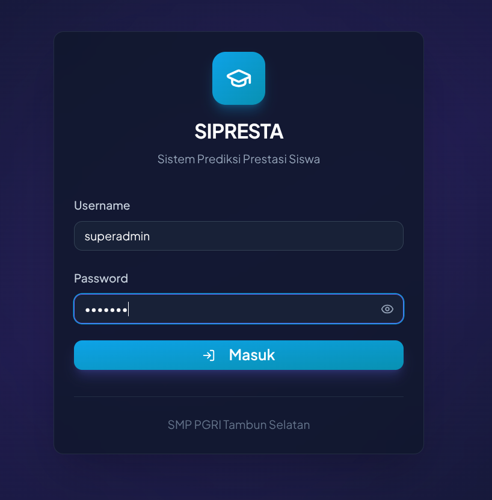

<!-- 📸 IMAGE NEEDED:
     URL: /login
     Show: Halaman login dengan username dan password terisi (password disembunyikan)
     Highlight: Kolom password dan ikon show/hide
     State: Kedua field terisi, password tersembunyi
-->

**Langkah 4:** Klik tombol **"Masuk"** berwarna biru


<!-- 📸 IMAGE NEEDED:
     URL: /login
     Show: Halaman login lengkap dengan kursor di atas tombol Masuk
     Highlight: Tombol Masuk berwarna biru
     State: Siap untuk login
-->

**Langkah 5:** Jika berhasil, Anda akan diarahkan ke halaman **Dashboard**

⚠️ **Peringatan:** Jika muncul pesan error, periksa kembali username dan password Anda. Jika lupa password, hubungi Super Admin untuk reset password.

### Pesan Error yang Mungkin Muncul:

| Pesan Error                    | Penyebab                | Solusi                       |
| ------------------------------ | ----------------------- | ---------------------------- |
| "Username minimal 3 karakter"  | Username terlalu pendek | Masukkan username yang benar |
| "Password harus diisi"         | Kolom password kosong   | Masukkan password Anda       |
| "Username atau password salah" | Data login tidak sesuai | Periksa dan coba lagi        |

## 2.2 Navigasi Aplikasi

Setelah login, Anda akan melihat **menu navigasi** di bagian atas halaman.


<!-- 📸 IMAGE NEEDED:
     URL: / (Dashboard)
     Show: Header navigasi dengan menu Dashboard, Model, Prediksi, Users (jika Super Admin), dan avatar user
     Highlight: Semua item menu navigasi
     State: Dashboard aktif (tersorot)
-->

### Menu Utama:

| Icon | Menu          | Fungsi                                       |
| ---- | ------------- | -------------------------------------------- |
| 📊   | **Dashboard** | Melihat ringkasan statistik dan grafik       |
| 🧠   | **Model**     | Mengelola model prediksi (buat, edit, hapus) |
| 📋   | **Prediksi**  | Melakukan prediksi prestasi siswa            |
| 👥   | **Users**     | Mengelola pengguna (hanya Super Admin)       |

### Fitur Navigasi Tambahan:

- **Avatar Pengguna:** Lingkaran dengan inisial nama Anda di pojok kanan atas
- **Menu Mobile:** Pada layar kecil, klik ikon hamburger (☰) untuk membuka menu

## 2.3 Keluar dari Sistem (Logout)

Selalu logout setelah selesai menggunakan SIPRESTA untuk menjaga keamanan akun Anda.

### Langkah-langkah Logout:

**Langkah 1:** Klik tombol yang terdapat nama akun (contoh Super Admin) di pojok kanan atas

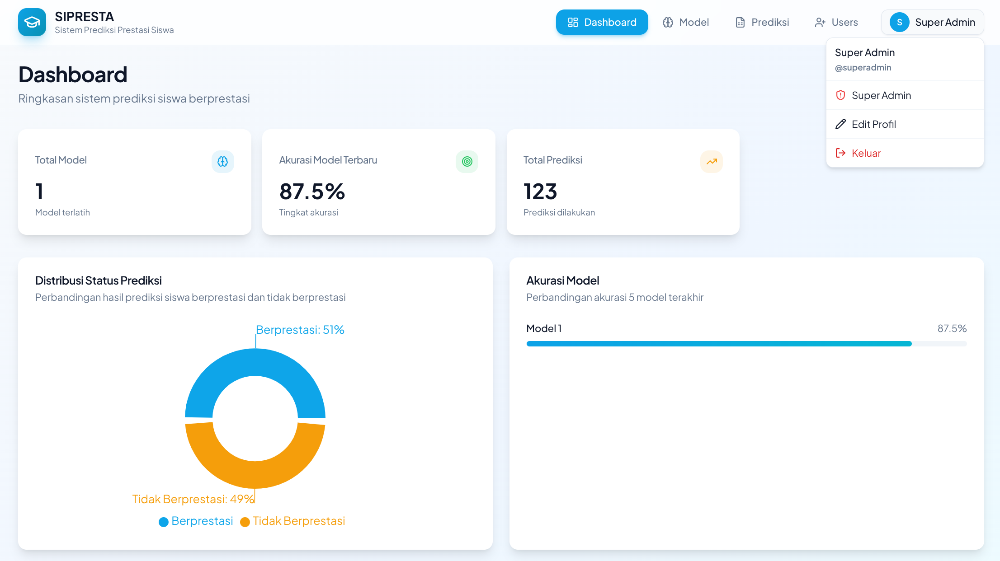

<!-- 📸 IMAGE NEEDED:
     URL: / (Dashboard)
     Show: Header dengan kursor di atas ikon hamburger menu
     Highlight: Ikon hamburger menu
     State: Menu belum terbuka
-->

**Langkah 2:** Menu akan terbuka menampilkan opsi:

- Dashboard
- Model
- Prediksi
- Users (jika Super Admin)
- Edit Profil
- **Keluar**


<!-- 📸 IMAGE NEEDED:
     URL: / (Dashboard)
     Show: Menu dropdown terbuka menampilkan semua opsi navigasi termasuk Edit Profil dan Keluar
     Highlight: Tombol "Keluar" di bagian bawah menu
     State: Menu mobile terbuka
-->

**Langkah 3:** Klik **"Keluar"**

**Langkah 4:** Anda akan diarahkan kembali ke halaman login

✅ **Tips Keamanan:**

- Selalu logout setelah selesai menggunakan aplikasi
- Jangan bagikan username dan password Anda kepada orang lain
- Gunakan password yang kuat dan unik

---

# 3. Dashboard

## 3.1 Memahami Dashboard

Dashboard adalah halaman utama yang menampilkan **ringkasan sistem prediksi siswa berprestasi**. Di sini Anda dapat melihat statistik penting secara sekilas.


<!-- 📸 IMAGE NEEDED:
     URL: / (Dashboard)
     Show: Tampilan dashboard lengkap dengan judul "Dashboard", subtitle, 4 kartu statistik, grafik pie dan bar, serta bagian "Tentang Sistem"
     Highlight: Seluruh area konten utama
     State: Setelah login dengan data contoh
-->

## 3.2 Statistik Utama

Di bagian atas dashboard, terdapat **4 kartu statistik** yang memberikan informasi penting:

### 📊 Total Model

Menunjukkan jumlah model prediksi yang telah dilatih dan tersimpan dalam sistem.

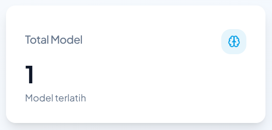

<!-- 📸 IMAGE NEEDED:
     URL: / (Dashboard)
     Show: Kartu statistik "Total Model" dengan angka dan ikon
     Highlight: Kartu Total Model
     State: Menampilkan angka "1" atau lebih
-->

<!-- ### 📂 Total Dataset

Menunjukkan jumlah dataset yang tersimpan dalam sistem. -->

### 🎯 Akurasi Model Terbaru

Menampilkan **tingkat akurasi** model prediksi terbaru dalam persentase. Semakin tinggi persentase, semakin akurat model dalam memprediksi.

💡 **Tips:** Akurasi di atas **80%** dianggap baik untuk model prediksi.

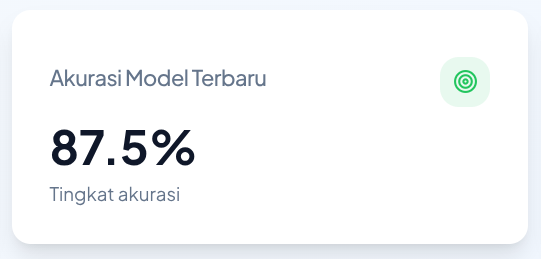

### 📈 Total Prediksi

Menunjukkan total prediksi yang telah dilakukan menggunakan sistem.

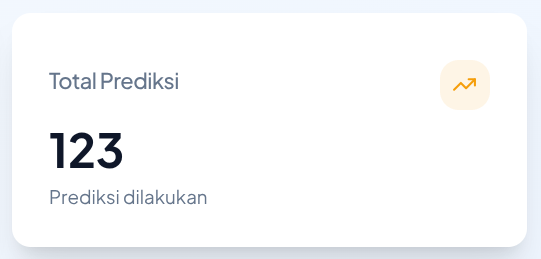

## 3.3 Grafik Distribusi Prediksi

Grafik **pie chart (donat)** menampilkan perbandingan hasil prediksi:

- 🔵 **Berprestasi:** Siswa yang diprediksi akan berprestasi
- 🟠 **Tidak Berprestasi:** Siswa yang diprediksi tidak akan berprestasi

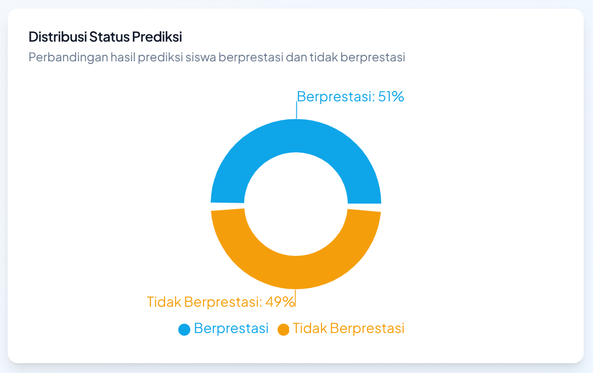

<!-- 📸 IMAGE NEEDED:
     URL: / (Dashboard)
     Show: Grafik pie chart dengan legenda "Berprestasi" dan "Tidak Berprestasi"
     Highlight: Grafik pie chart dan persentase
     State: Menampilkan data contoh (misalnya 51% Berprestasi, 49% Tidak Berprestasi)
-->

### Cara Membaca Grafik:

1. **Warna Biru** = Persentase siswa berprestasi
2. **Warna Oranye** = Persentase siswa tidak berprestasi
3. Arahkan kursor ke grafik untuk melihat detail persentase

## 3.4 Informasi Akurasi Model

Bagian **"Akurasi Model"** menampilkan perbandingan akurasi dari model-model yang tersedia.

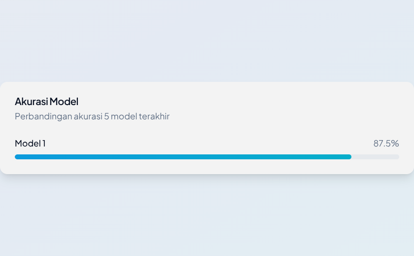

<!-- 📸 IMAGE NEEDED:
     URL: / (Dashboard)
     Show: Bar chart horizontal menampilkan akurasi model dengan nama model dan persentase
     Highlight: Bar chart akurasi model
     State: Menampilkan minimal 1 model dengan akurasinya
-->

### Tentang Sistem

Di bagian bawah dashboard, terdapat penjelasan singkat tentang sistem:

> Sistem ini menggunakan metode **Classification and Regression Tree (CART)** untuk memprediksi status prestasi siswa berdasarkan nilai mata pelajaran dan kehadiran.

---

# 4. Manajemen Model

Model adalah "otak" dari sistem prediksi. Model dilatih menggunakan data historis siswa untuk dapat memprediksi siswa baru.

## 4.1 Melihat Daftar Model

### Langkah-langkah:

**Langkah 1:** Klik menu **"Model"** pada navigasi

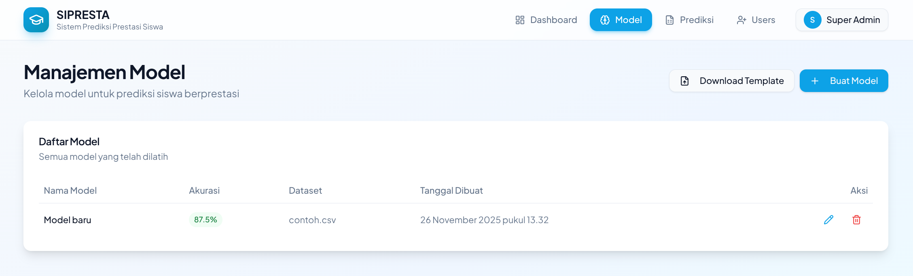

<!-- 📸 IMAGE NEEDED:
     URL: /model
     Show: Halaman Manajemen Model dengan tabel daftar model
     Highlight: Menu Model pada navigasi (tersorot aktif)
     State: Halaman model dengan minimal 1 model tersedia
-->

**Langkah 2:** Halaman **"Manajemen Model"** akan ditampilkan

### Informasi yang Tersedia:

| Kolom              | Keterangan                                     |
| ------------------ | ---------------------------------------------- |
| **Nama Model**     | Nama yang diberikan untuk model                |
| **Akurasi**        | Tingkat keakuratan model (dalam persen)        |
| **Dataset**        | Nama file dataset yang digunakan untuk melatih |
| **Tanggal Dibuat** | Waktu model dibuat                             |
| **Aksi**           | Tombol edit dan hapus                          |

<!-- 📸 IMAGE NEEDED:
     URL: /model
     Show: Tabel dengan kolom Nama Model, Akurasi, Dataset, Tanggal Dibuat, dan Aksi
     Highlight: Seluruh tabel dengan data contoh
     State: Menampilkan minimal 1 model
-->

## 4.2 Membuat Model Baru

Untuk membuat model baru, Anda perlu menyiapkan file **CSV** dengan format yang sesuai.

### Langkah-langkah Membuat Model:

**Langkah 1:** Pada halaman Model, klik tombol **"+ Buat Model"** berwarna biru di pojok kanan atas


<!-- 📸 IMAGE NEEDED:
     URL: /model
     Show: Halaman model dengan kursor di atas tombol "Buat Model"
     Highlight: Tombol "+ Buat Model" berwarna biru
     State: Sebelum modal dibuka
-->

**Langkah 2:** Modal **"Buat Model Baru"** akan muncul

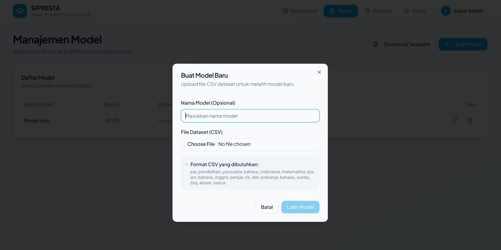

<!-- 📸 IMAGE NEEDED:
     URL: /model
     Show: Modal dialog dengan form Nama Model, File Dataset (CSV), informasi format CSV, dan tombol Batal & Latih Model
     Highlight: Seluruh modal
     State: Modal terbuka dengan form kosong
-->

**Langkah 3:** Isi **Nama Model** (opsional)

- Jika tidak diisi, sistem akan memberikan nama otomatis

**Langkah 4:** Klik **"Choose File"** untuk memilih file dataset CSV

⚠️ **Penting:** File CSV harus memiliki format yang benar. Lihat bagian [Format CSV](#format-csv-yang-diperlukan) di bawah.

**Langkah 5:** Klik tombol **"Latih Model"**

**Langkah 6:** Tunggu proses pelatihan selesai

✅ **Setelah Berhasil:**

- Model baru akan muncul di daftar model
- Akurasi model akan ditampilkan
- Model siap digunakan untuk prediksi

### Format CSV yang Diperlukan

File CSV harus memiliki kolom-kolom berikut:

| No  | Nama Kolom             | Keterangan                   | Tipe Data                            |
| --- | ---------------------- | ---------------------------- | ------------------------------------ |
| 1   | `pai`                  | Nilai Pendidikan Agama Islam | Angka                                |
| 2   | `pendidikan_pancasila` | Nilai Pendidikan Pancasila   | Angka                                |
| 3   | `bahasa_indonesia`     | Nilai Bahasa Indonesia       | Angka                                |
| 4   | `matematika`           | Nilai Matematika             | Angka                                |
| 5   | `ipa`                  | Nilai IPA                    | Angka                                |
| 6   | `ips`                  | Nilai IPS                    | Angka                                |
| 7   | `bahasa_inggris`       | Nilai Bahasa Inggris         | Angka                                |
| 8   | `penjas`               | Nilai Pendidikan Jasmani     | Angka                                |
| 9   | `tik`                  | Nilai TIK                    | Angka                                |
| 10  | `sbk`                  | Nilai Seni Budaya            | Angka                                |
| 11  | `prakarya`             | Nilai Prakarya               | Angka                                |
| 12  | `bahasa_sunda`         | Nilai Bahasa Sunda           | Angka                                |
| 13  | `btq`                  | Nilai Baca Tulis Quran       | Angka                                |
| 14  | `absen`                | Jumlah Ketidakhadiran        | Angka                                |
| 15  | `status`               | Status Prestasi (target)     | Teks (Berprestasi/Tidak Berprestasi) |

💡 **Tips:** Gunakan fitur **Download Template** untuk mendapatkan format yang benar.

## 4.3 Mengedit Nama Model

### Langkah-langkah:

**Langkah 1:** Pada daftar model, cari model yang ingin diedit

**Langkah 2:** Klik ikon **✏️ (pensil)** pada kolom Aksi


<!-- 📸 IMAGE NEEDED:
     URL: /model
     Show: Baris model dengan kursor di atas ikon edit (pensil)
     Highlight: Ikon pensil pada kolom Aksi
     State: Hover pada tombol edit
-->

**Langkah 3:** Modal edit akan muncul

**Langkah 4:** Ubah nama model sesuai keinginan

**Langkah 5:** Klik **"Simpan"** untuk menyimpan perubahan

## 4.4 Menghapus Model

⚠️ **Peringatan:** Model yang dihapus tidak dapat dikembalikan!

### Langkah-langkah:

**Langkah 1:** Pada daftar model, cari model yang ingin dihapus

**Langkah 2:** Klik ikon **🗑️ (tempat sampah)** pada kolom Aksi

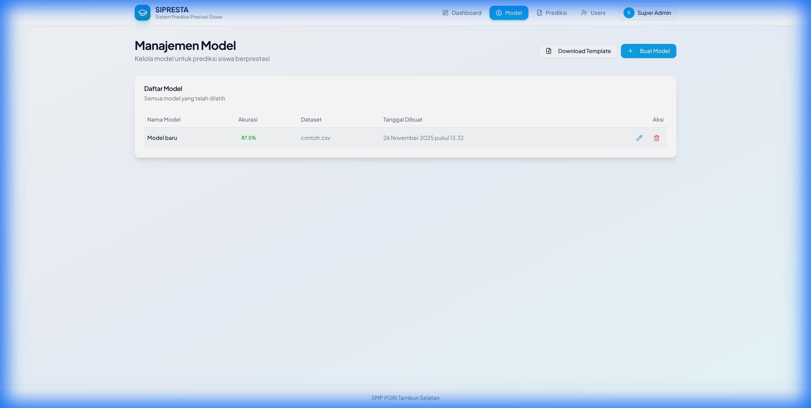

<!-- 📸 IMAGE NEEDED:
     URL: /model
     Show: Baris model dengan kursor di atas ikon hapus (tempat sampah merah)
     Highlight: Ikon hapus pada kolom Aksi
     State: Hover pada tombol hapus
-->

**Langkah 3:** Konfirmasi penghapusan

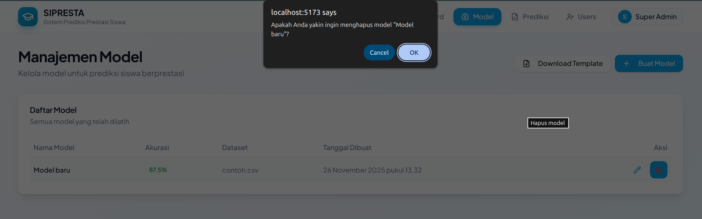

**Langkah 4:** Model akan dihapus dari daftar

## 4.5 Download Template CSV

Untuk memudahkan pembuatan file dataset, SIPRESTA menyediakan template CSV yang dapat diunduh.

### Langkah-langkah:

**Langkah 1:** Pada halaman Model, klik tombol **"Download Template"**


<!-- 📸 IMAGE NEEDED:
     URL: /model
     Show: Header halaman model dengan tombol Download Template dan Buat Model
     Highlight: Tombol "Download Template"
     State: Sebelum diklik
-->

**Langkah 2:** File template akan terunduh ke komputer Anda

**Langkah 3:** Buka file dengan Microsoft Excel atau Google Sheets

**Langkah 4:** Isi data siswa sesuai kolom yang tersedia

**Langkah 5:** Simpan file dalam format CSV

---

# 5. Prediksi Siswa

Fitur Prediksi memungkinkan Anda memprediksi status prestasi siswa menggunakan model yang telah dilatih.

## 5.1 Prediksi Satu Siswa

Gunakan fitur ini untuk memprediksi satu siswa secara individual.

### Langkah-langkah:

**Langkah 1:** Klik menu **"Prediksi"** pada navigasi

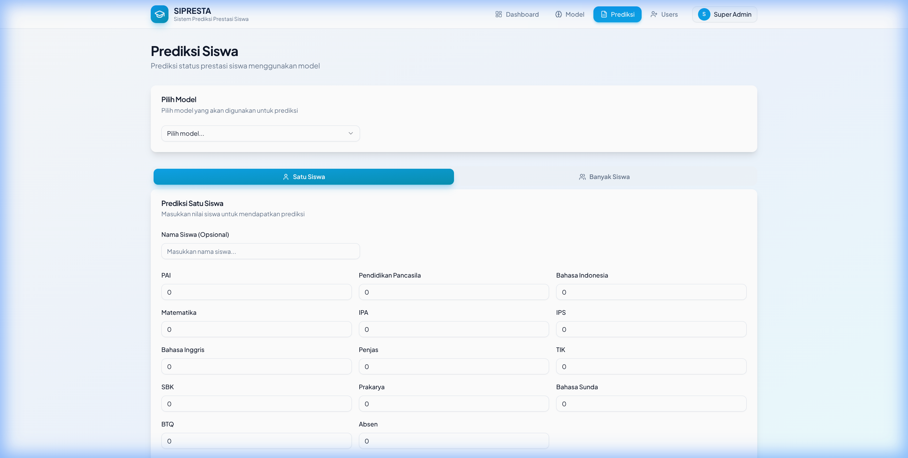

<!-- 📸 IMAGE NEEDED:
     URL: /prediksi
     Show: Halaman Prediksi Siswa dengan tab Satu Siswa aktif
     Highlight: Menu Prediksi pada navigasi (tersorot)
     State: Tab Satu Siswa terpilih
-->

**Langkah 2:** Pastikan tab **"Satu Siswa"** 👤 sudah dipilih (tab biru)

**Langkah 3:** Pilih **Model** yang akan digunakan dari dropdown

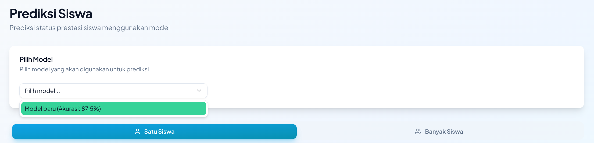

<!-- 📸 IMAGE NEEDED:
     URL: /prediksi
     Show: Dropdown "Pilih Model" dengan daftar model yang tersedia
     Highlight: Dropdown pemilihan model
     State: Dropdown terbuka menampilkan daftar model
-->

**Langkah 4:** Isi **Nama Siswa** (opsional)

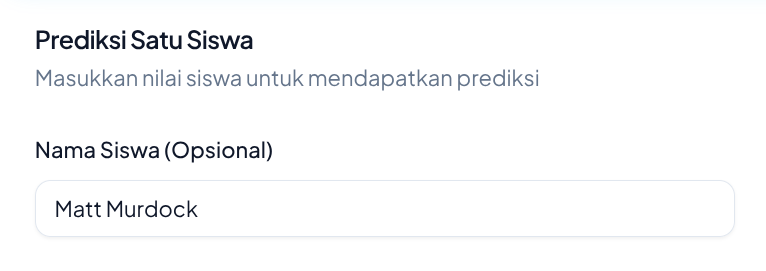

**Langkah 5:** Isi nilai untuk setiap mata pelajaran:

| Mata Pelajaran       | Rentang Nilai           |
| -------------------- | ----------------------- |
| PAI                  | 0 - 100                 |
| Pendidikan Pancasila | 0 - 100                 |
| Bahasa Indonesia     | 0 - 100                 |
| Matematika           | 0 - 100                 |
| IPA                  | 0 - 100                 |
| IPS                  | 0 - 100                 |
| Bahasa Inggris       | 0 - 100                 |
| Penjas               | 0 - 100                 |
| TIK                  | 0 - 100                 |
| SBK                  | 0 - 100                 |
| Prakarya             | 0 - 100                 |
| Bahasa Sunda         | 0 - 100                 |
| BTQ                  | 0 - 100                 |
| Absen                | Jumlah hari tidak hadir |

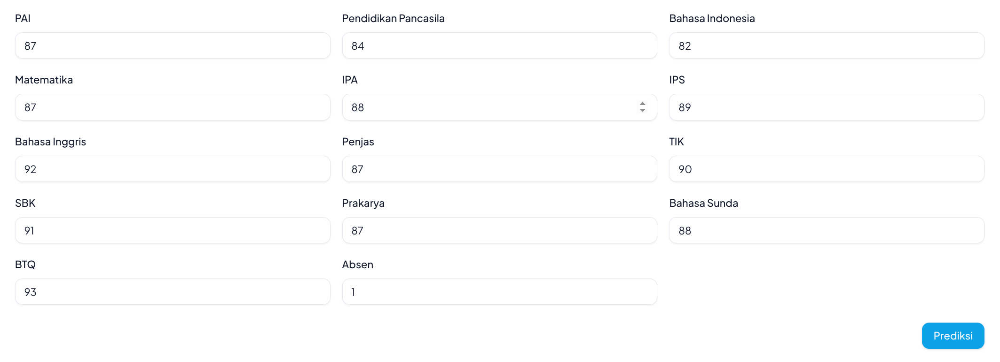

<!-- 📸 IMAGE NEEDED:
     URL: /prediksi
     Show: Form input nilai dengan semua field mata pelajaran terisi contoh data
     Highlight: Grid input nilai mata pelajaran
     State: Form terisi dengan data contoh
-->

**Langkah 6:** Klik tombol **"Prediksi"** 🔮


<!-- 📸 IMAGE NEEDED:
     URL: /prediksi
     Show: Bagian bawah form dengan tombol Prediksi
     Highlight: Tombol Prediksi berwarna biru
     State: Siap untuk klik
-->

**Langkah 7:** Hasil prediksi akan ditampilkan

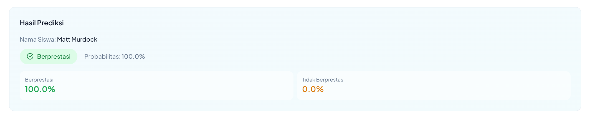

### Memahami Hasil Prediksi:

| Hasil                    | Arti                                                         |
| ------------------------ | ------------------------------------------------------------ |
| 🟢 **Berprestasi**       | Siswa diprediksi akan mencapai prestasi yang baik            |
| 🔴 **Tidak Berprestasi** | Siswa diprediksi memerlukan perhatian dan bimbingan tambahan |

## 5.2 Prediksi Banyak Siswa (Batch)

Gunakan fitur ini untuk memprediksi banyak siswa sekaligus menggunakan file CSV.

### Langkah-langkah:

**Langkah 1:** Klik menu **"Prediksi"** pada navigasi

**Langkah 2:** Klik tab **"Banyak Siswa"** 👥

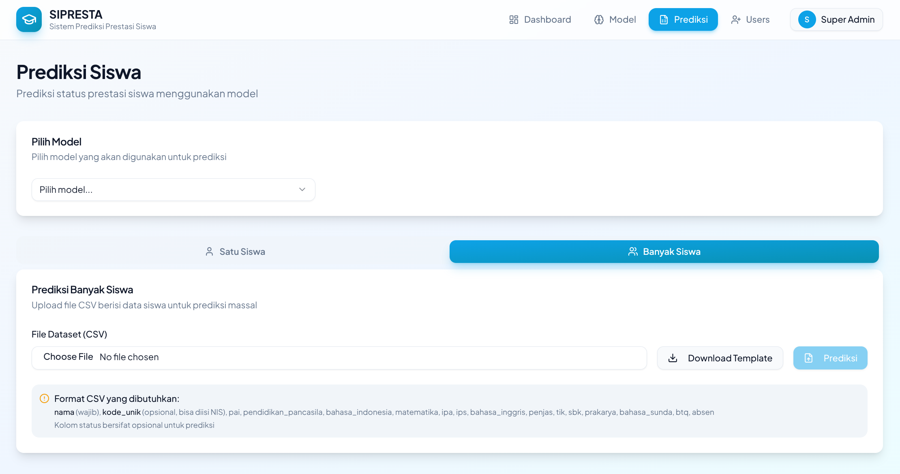

<!-- 📸 IMAGE NEEDED:
     URL: /prediksi
     Show: Halaman Prediksi dengan tab "Banyak Siswa" aktif
     Highlight: Tab Banyak Siswa (berwarna biru)
     State: Tab Banyak Siswa terpilih, menampilkan form upload
-->

**Langkah 3:** Pilih **Model** yang akan digunakan dari dropdown

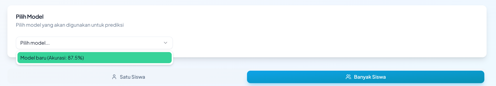

**Langkah 4:** Klik **"Choose File"** untuk memilih file CSV


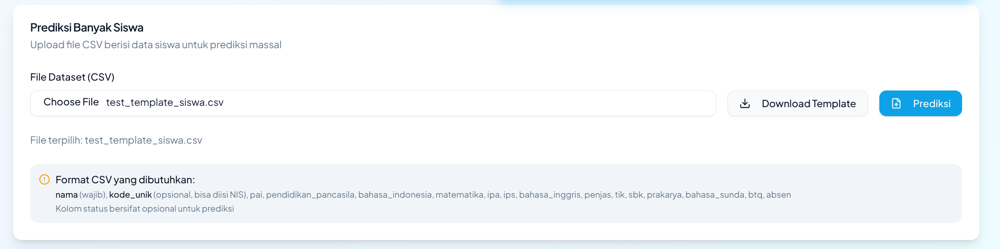

<!-- 📸 IMAGE NEEDED:
     URL: /prediksi
     Show: Form upload file CSV dengan tombol Choose File, Download Template, dan Prediksi
     Highlight: Area upload file dan informasi format CSV
     State: Sebelum file dipilih
-->

### Format CSV untuk Prediksi Massal:

File CSV harus memiliki kolom:

- `nama` (wajib) - Nama siswa
- `kode_unik` (opsional) - Bisa diisi dengan NIS
- Semua kolom nilai mata pelajaran
- `status` (opsional) - Tidak perlu diisi untuk prediksi

💡 **Tips:** Klik **"Download Template"** untuk mendapatkan format yang benar

**Langkah 5:** Klik tombol **"Prediksi"**


**Langkah 6:** Hasil prediksi untuk semua siswa akan ditampilkan


## 5.3 Memahami Hasil Prediksi

### Interpretasi Hasil:

✅ **Berprestasi:**

- Siswa memiliki nilai rata-rata yang baik
- Kehadiran teratur
- Potensi akademik yang tinggi

⚠️ **Tidak Berprestasi:**

- Siswa mungkin memerlukan bimbingan tambahan
- Perlu perhatian khusus dari guru dan wali kelas
- Bukan berarti siswa "tidak mampu", tetapi memerlukan dukungan lebih

💡 **Tips Penggunaan Hasil Prediksi:**

1. Gunakan hasil sebagai **referensi**, bukan keputusan final
2. Kombinasikan dengan observasi langsung guru
3. Libatkan orang tua dalam pembinaan siswa
4. Buat program remedial untuk siswa yang diprediksi tidak berprestasi

---

# 6. Manajemen Pengguna (Super Admin)

⚠️ **Catatan:** Fitur ini hanya tersedia untuk pengguna dengan role **Super Admin**.

## 6.1 Melihat Daftar Pengguna

### Langkah-langkah:

**Langkah 1:** Klik menu **"Users"** pada navigasi

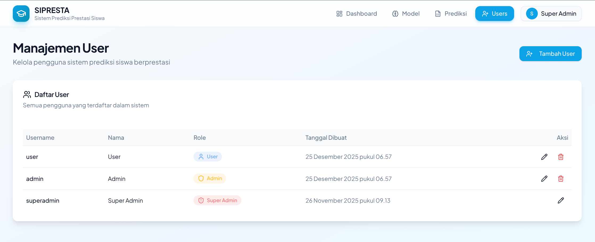

<!-- 📸 IMAGE NEEDED:
     URL: /register
     Show: Halaman Manajemen User dengan tabel daftar pengguna
     Highlight: Menu Users pada navigasi (tersorot)
     State: Halaman Users dengan daftar pengguna
-->

**Langkah 2:** Halaman **"Manajemen User"** akan ditampilkan

### Informasi yang Tersedia:

| Kolom              | Keterangan                               |
| ------------------ | ---------------------------------------- |
| **Username**       | Nama pengguna untuk login                |
| **Nama**           | Nama lengkap pengguna                    |
| **Role**           | Tingkatan akses (User/Admin/Super Admin) |
| **Tanggal Dibuat** | Waktu akun dibuat                        |
| **Aksi**           | Tombol edit dan hapus                    |


<!-- 📸 IMAGE NEEDED:
     URL: /register
     Show: Tabel pengguna dengan kolom Username, Nama, Role, Tanggal Dibuat, dan Aksi
     Highlight: Seluruh tabel dengan badge warna berbeda untuk setiap role
     State: Menampilkan beberapa pengguna dengan role berbeda
     Notes: Perhatikan badge warna - User (biru), Admin (kuning), Super Admin (oranye)
-->

### Badge Role:

- 🔵 **User** - Badge biru
- 🟡 **Admin** - Badge kuning
- 🟠 **Super Admin** - Badge oranye

## 6.2 Menambah Pengguna Baru

### Langkah-langkah:

**Langkah 1:** Klik tombol **"+ Tambah User"** berwarna biru


<!-- 📸 IMAGE NEEDED:
     URL: /register
     Show: Header halaman Users dengan kursor di atas tombol Tambah User
     Highlight: Tombol "+ Tambah User"
     State: Sebelum modal dibuka
-->

**Langkah 2:** Modal **"Tambah User Baru"** akan muncul

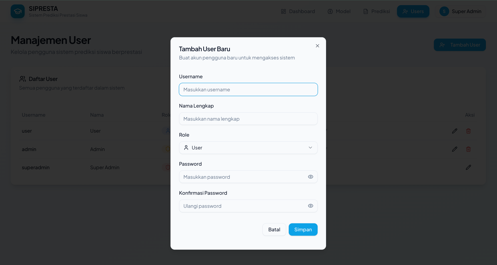

<!-- 📸 IMAGE NEEDED:
     URL: /register
     Show: Modal dialog dengan form Username, Nama Lengkap, Role (dropdown), Password, Konfirmasi Password, dan tombol Batal & Simpan
     Highlight: Seluruh modal
     State: Modal terbuka dengan form kosong
-->

**Langkah 3:** Isi form dengan data pengguna baru:

| Field                   | Keterangan                         | Wajib? |
| ----------------------- | ---------------------------------- | ------ |
| **Username**            | Nama untuk login (min. 3 karakter) | ✅ Ya  |
| **Nama Lengkap**        | Nama lengkap pengguna              | ✅ Ya  |
| **Role**                | Pilih tingkatan akses              | ✅ Ya  |
| **Password**            | Kata sandi (min. 6 karakter)       | ✅ Ya  |
| **Konfirmasi Password** | Ulangi password                    | ✅ Ya  |

**Langkah 4:** Pilih **Role** dari dropdown:

- **User** - Akses standar
- **Admin** - Akses lebih tinggi
- **Super Admin** - Akses penuh

**Langkah 5:** Klik tombol **"Simpan"**

✅ **Setelah Berhasil:**

- Pengguna baru akan muncul di daftar
- Pengguna dapat login dengan username dan password yang dibuat

## 6.3 Mengedit Pengguna

### Langkah-langkah:

**Langkah 1:** Pada daftar pengguna, cari pengguna yang ingin diedit

**Langkah 2:** Klik ikon **✏️ (pensil)** pada kolom Aksi


<!-- 📸 IMAGE NEEDED:
     URL: /register
     Show: Baris pengguna dengan kursor di atas ikon edit
     Highlight: Ikon pensil pada kolom Aksi
     State: Hover pada tombol edit
-->

**Langkah 3:** Modal edit akan muncul dengan data pengguna

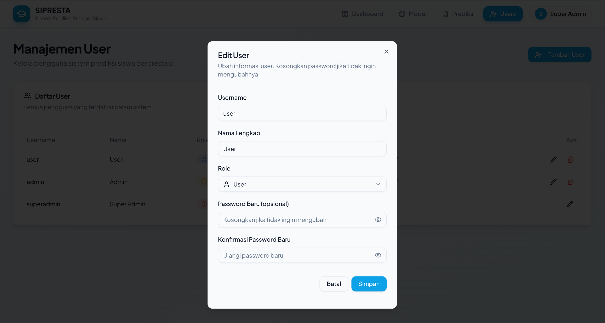

**Langkah 4:** Ubah data yang diperlukan

**Langkah 5:** Klik **"Simpan"** untuk menyimpan perubahan


## 6.4 Menghapus Pengguna

⚠️ **Peringatan:**

- Pengguna yang dihapus tidak dapat dikembalikan!
- Super Admin tidak dapat dihapus

### Langkah-langkah:

**Langkah 1:** Pada daftar pengguna, cari pengguna yang ingin dihapus

**Langkah 2:** Klik ikon **🗑️ (tempat sampah)** pada kolom Aksi


<!-- 📸 IMAGE NEEDED:
     URL: /register
     Show: Baris pengguna dengan kursor di atas ikon hapus
     Highlight: Ikon hapus merah pada kolom Aksi
     State: Hover pada tombol hapus
     Notes: Tunjukkan bahwa Super Admin tidak memiliki tombol hapus
-->

**Langkah 3:** Konfirmasi penghapusan

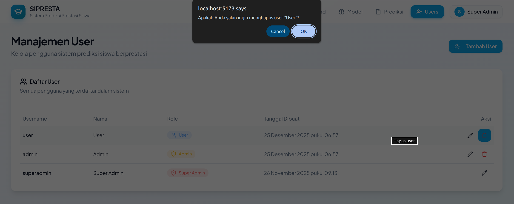

**Langkah 4:** Pengguna akan dihapus dari sistem

💡 **Tips:**

- Sebelum menghapus, pertimbangkan untuk mengubah role menjadi User terlebih dahulu
- Pastikan tidak ada data penting yang terkait dengan pengguna tersebut

---

# 7. Pengaturan Profil

## 7.1 Mengedit Profil

Setiap pengguna dapat mengedit profil mereka sendiri.

### Langkah-langkah:

**Langkah 1:** Klik ikon menu (☰) di pojok kanan atas

**Langkah 2:** Klik **"Edit Profil"**


<!-- 📸 IMAGE NEEDED:
     URL: / (Dashboard)
     Show: Menu mobile terbuka dengan opsi Edit Profil tersorot
     Highlight: Tombol "Edit Profil"
     State: Menu terbuka
-->

**Langkah 3:** Modal **"Edit Profil"** akan muncul

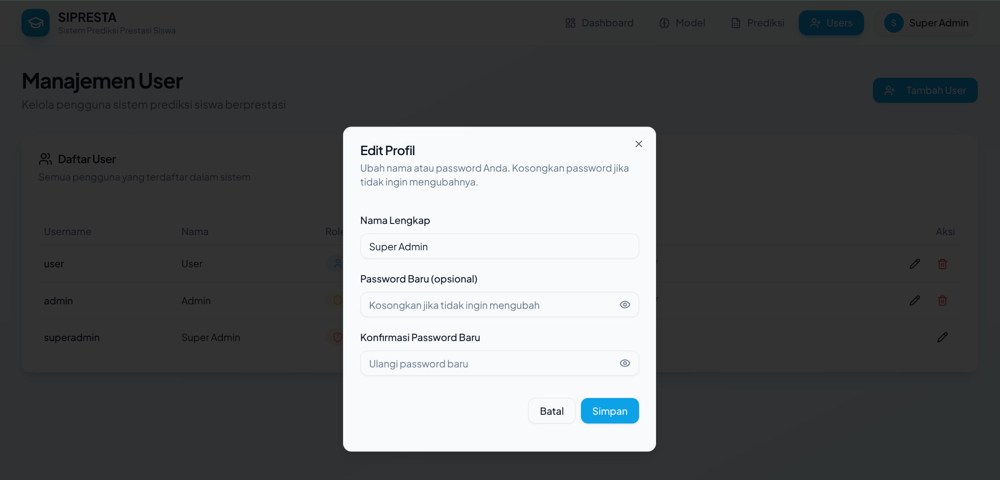

<!-- 📸 IMAGE NEEDED:
     URL: / (Dashboard)
     Show: Modal Edit Profil dengan field Nama Lengkap, Password Baru, Konfirmasi Password Baru, dan tombol Batal & Simpan
     Highlight: Seluruh modal
     State: Modal terbuka dengan nama terisi, password kosong
-->

**Langkah 4:** Ubah **Nama Lengkap** jika diperlukan

**Langkah 5:** Klik **"Simpan"**

## 7.2 Mengubah Password

### Langkah-langkah:

**Langkah 1:** Buka modal Edit Profil (seperti langkah di atas)

**Langkah 2:** Isi field **"Password Baru (opsional)"**

**Langkah 3:** Isi field **"Konfirmasi Password Baru"** dengan password yang sama

**Langkah 4:** Klik **"Simpan"**

💡 **Tips Password Aman:**

- Gunakan minimal 8 karakter
- Kombinasikan huruf besar, huruf kecil, angka, dan simbol
- Jangan gunakan informasi pribadi (tanggal lahir, nama)
- Ganti password secara berkala

⚠️ **Catatan:** Jika tidak ingin mengubah password, kosongkan kedua field password.

---

# 8. Panduan Cepat

## 🚀 Quick Start Guide (5 Menit)

Untuk pengguna baru, ikuti langkah-langkah singkat ini:

### 1️⃣ Login ke Sistem

```
1. Buka aplikasi SIPRESTA
2. Masukkan username dan password
3. Klik "Masuk"
```

### 2️⃣ Lihat Dashboard

```
1. Setelah login, Anda akan melihat dashboard
2. Perhatikan statistik: Total Model, Akurasi, Total Prediksi
3. Lihat grafik distribusi prediksi
```

### 3️⃣ Lakukan Prediksi Pertama

```
1. Klik menu "Prediksi"
2. Pilih model dari dropdown
3. Isi nilai siswa
4. Klik "Prediksi"
5. Lihat hasilnya!
```

### 4️⃣ Logout dengan Aman

```
1. Klik ikon menu (☰)
2. Klik "Keluar"
3. Selesai!
```

## ⌨️ Navigasi Cepat

| Dari              | Ke        | Cara                                     |
| ----------------- | --------- | ---------------------------------------- |
| Halaman Mana Saja | Dashboard | Klik logo SIPRESTA atau menu "Dashboard" |
| Halaman Mana Saja | Model     | Klik menu "Model"                        |
| Halaman Mana Saja | Prediksi  | Klik menu "Prediksi"                     |
| Halaman Mana Saja | Users     | Klik menu "Users" (Super Admin saja)     |

---

# 9. Troubleshooting & FAQ

## ❓ Pertanyaan Umum (FAQ)

### Q: Saya lupa password, bagaimana cara reset?

**A:** Hubungi Super Admin sekolah Anda. Super Admin dapat mengubah password melalui menu Manajemen User.

### Q: Mengapa saya tidak bisa melihat menu "Users"?

**A:** Menu Users hanya tersedia untuk pengguna dengan role **Super Admin**. Jika Anda memerlukan akses, hubungi Super Admin.

### Q: Berapa akurasi model yang dianggap baik?

**A:** Akurasi di atas **80%** dianggap baik. Namun, selalu kombinasikan hasil prediksi dengan observasi langsung guru.

### Q: Apakah hasil prediksi selalu akurat?

**A:** Hasil prediksi adalah **estimasi** berdasarkan data historis. Gunakan sebagai referensi, bukan keputusan final.

### Q: Format CSV seperti apa yang harus saya gunakan?

**A:** Gunakan template yang disediakan dengan mengklik tombol "Download Template" di halaman Model atau Prediksi.

### Q: Bisakah saya menghapus model yang sudah dibuat?

**A:** Ya, klik ikon tempat sampah (🗑️) pada baris model yang ingin dihapus. Perhatikan bahwa penghapusan bersifat permanen.

### Q: Bagaimana cara logout dari sistem?

**A:** Klik ikon menu (☰) di pojok kanan atas, lalu klik "Keluar".

## 🔧 Troubleshooting

### Problem: Login gagal

| Gejala                         | Kemungkinan Penyebab          | Solusi                                          |
| ------------------------------ | ----------------------------- | ----------------------------------------------- |
| "Username atau password salah" | Salah ketik username/password | Periksa caps lock dan ketik ulang dengan teliti |
| "Username minimal 3 karakter"  | Username terlalu pendek       | Pastikan username minimal 3 karakter            |
| "Password harus diisi"         | Kolom password kosong         | Isi kolom password                              |
| Halaman tidak redirect         | Session expired               | Refresh halaman dan coba login lagi             |

### Problem: File CSV ditolak

| Gejala              | Kemungkinan Penyebab   | Solusi                                           |
| ------------------- | ---------------------- | ------------------------------------------------ |
| Format tidak sesuai | Kolom tidak lengkap    | Download template dan sesuaikan                  |
| File tidak terbaca  | Format bukan CSV       | Simpan file sebagai CSV (Comma Separated Values) |
| Data kosong         | Tidak ada data di file | Isi minimal 1 baris data siswa                   |

### Problem: Prediksi tidak berjalan

| Gejala          | Kemungkinan Penyebab   | Solusi                                   |
| --------------- | ---------------------- | ---------------------------------------- |
| Tidak ada hasil | Model belum dipilih    | Pilih model dari dropdown                |
| Error           | Data input tidak valid | Pastikan semua nilai dalam rentang 0-100 |
| Loading terus   | Koneksi lambat         | Tunggu atau refresh halaman              |

## 📞 Bantuan Lebih Lanjut

Jika Anda mengalami masalah yang tidak tercantum di atas:

1. **Hubungi Super Admin** sekolah Anda
2. **Catat pesan error** yang muncul
3. **Screenshot** layar untuk memudahkan diagnosa

---

# 10. Glosarium

| Istilah               | Definisi                                                                       |
| --------------------- | ------------------------------------------------------------------------------ |
| **SIPRESTA**          | Sistem Prediksi Prestasi Siswa                                                 |
| **CART**              | Classification and Regression Tree - metode machine learning untuk klasifikasi |
| **Model**             | Program komputer yang dilatih untuk memprediksi berdasarkan data historis      |
| **Dataset**           | Kumpulan data yang digunakan untuk melatih model                               |
| **Akurasi**           | Persentase kebenaran prediksi model dibandingkan data sebenarnya               |
| **Prediksi**          | Hasil perkiraan status prestasi siswa                                          |
| **CSV**               | Comma Separated Values - format file untuk menyimpan data tabular              |
| **Role**              | Tingkatan akses pengguna dalam sistem                                          |
| **Super Admin**       | Pengguna dengan akses penuh ke semua fitur termasuk manajemen user             |
| **Admin**             | Pengguna dengan akses ke model dan prediksi, tanpa manajemen user              |
| **User**              | Pengguna standar dengan akses ke model dan prediksi                            |
| **Berprestasi**       | Status siswa yang diprediksi akan mencapai prestasi baik                       |
| **Tidak Berprestasi** | Status siswa yang diprediksi memerlukan bimbingan tambahan                     |
| **Template**          | File contoh dengan format yang benar untuk diisi data                          |
| **Batch Prediction**  | Prediksi banyak siswa sekaligus menggunakan file CSV                           |
| **Login**             | Proses masuk ke sistem dengan username dan password                            |
| **Logout**            | Proses keluar dari sistem                                                      |
| **NIS**               | Nomor Induk Siswa                                                              |

---

# 📝 Catatan Pembaruan

| Versi | Tanggal       | Perubahan                 |
| ----- | ------------- | ------------------------- |
| 1.0   | Desember 2025 | Rilis pertama dokumentasi |

---

<div align="center">

**SIPRESTA - Sistem Prediksi Prestasi Siswa**

_Membantu sekolah mengidentifikasi dan membina siswa menuju prestasi yang lebih baik_

© 2025 SMP PGRI Tambun Selatan

</div>
